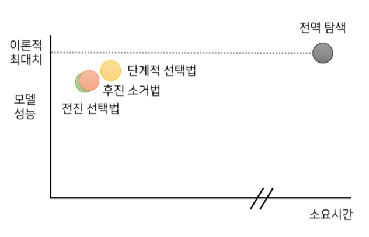
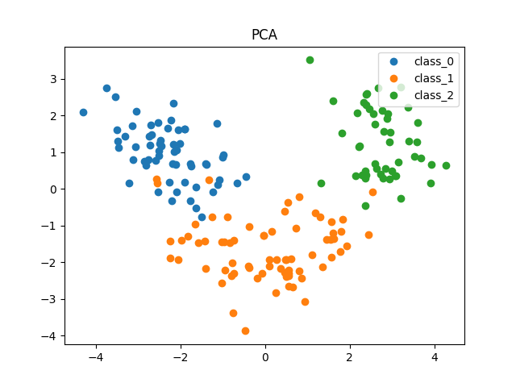
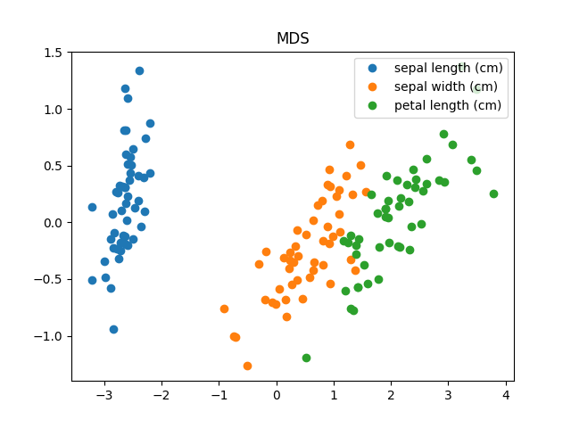
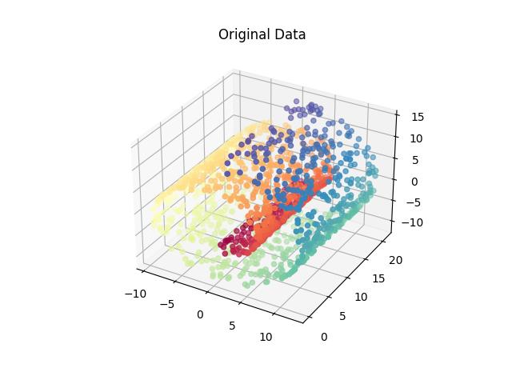
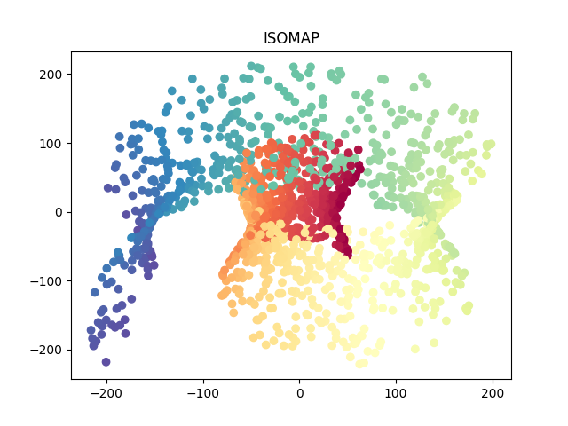
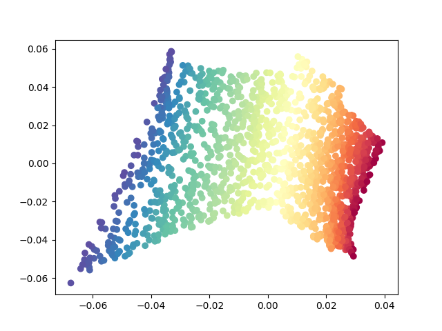

# Topic1: Dimensionality Reduction
비즈니스애널리틱스(IME654)의 첫번째 주제인 차원축소입니다.
(김도현 2022020651)

Tutorial은 다음과 같은 환경에서 수행하였습니다.
>scikit-learn == 1.0.2 \
>numpy == 1.21.6 \
>matplotlib == 3.5.3 \
>pandas == 1.3.5


## Contents
0. Overview
1. supervised Method
    - [Forward Selection](#1-2-forward-selection), [Backward elimination](#1-3-backward-elimination), [Stepwise selection](#1-4-stepwise-selection), [Genetic Algorithm](#1-5-genetic-algorithm-ga)
2. Unsupervised Method (Linear embedding)
    - [PCA](#2-1-principal-component-analysis-pca) [(Tutorial)](./PCA.py), [MDS](#2-2-multidimensional-scaling-mds) [(Tutorial)](./MDS.py)
3. Unsupervised Method (Nonlinear embedding) 
    - [ISOMAP](#3-1-isometric-feature-mapping-isomap) [(Tutorial)](./ISOMAP.py), [LLE](#3-2-local-linear-embedding-lle) [(Tutorial)](./LLE.py), [t-SNE](#3-3-t-stochastic-neighbor-embedding-t-sne)

---
# 0. Overview

차원축소는 일반적으로 데이터 전처리에 해당한다. 이론적으로는 데이터가 가진 차원이 높을수록 모델의 성능이 향상되지만, 변수가 많아질수록 모델이 데이터의 속성을 잘 캐치해서 분석된 것인지 우연히 plane했는데 잘 나온 것인지 해석이 애매해진다. 또한, 실제 데이터에 존재하는 노이즈 등의 문제로 변수의 수가 일정 수준 이상 증가하면 모델의 성능이 오히려 저하되는 경향을 보인다. 즉, 실제 데이터의 차원은 매우 크더라도 내재된 차원은 원래 차원의 수보다 낮은 경우가 대부분이다. 따라서 변수는 가급적 적게 하는게 좋다.

따라서 차원축소는 분석 과정에서 성능을 저하시키지 않는 최소한의 변수 집합을 판별하는데 목적이 있다.

차원축소의 방식
- Supervised dimensionlity reduction
- Unsupervised dimensionlity reduction

차원축소는 방식에 따라 교사적, 비교사적인 방식으로 나눠 생각할 수 있다. 교사적 차원 축소의 경우 축소된 차원의 적합성을 검증하는데 있어 예측 모델을 적용해 판단하고, 비교사적 차원 축소의 경우 예측 모델을 사용하지 않는 점에서 둘의 차이가 있다.
다만, 차원축소 기법에 따라서 변수 선택 혹은 변수 추출방법으로 차원이 축소된다. 변수 선택은 원래의 변수 집단으로부터 유용할 것으로 판단되는 소수의 변수들을 선택하는 것이고, 변수 추출은 원래의 변수 집단을 보다 효율적인 적은 수의 새로운 변수 집단으로 변환하는 것이다.

---
# 1. Supervised Method
교사적 차원축소 방법을 살펴본다. 교사적 차원축소에는 전역탐색, 전진 선택법, 후진소거법, 단계적 선택법 등이 있다.

## 1-1. Exhaustive Search
전역 탐색은 가능한 모든 경우의 조합에 대해 모델을 구축한 뒤 최적의 변수 조합을 찾는 방식이다. 하지만, 전역 탐색의 경우 이론적으로 가장 좋지만 현실적으로 많은 시간이 소모되기 때문에 유효한 변수선택 기법이 아니다.

## 1-2. Forward Selection
전진선택법은 설명변수가 하나도 없는 모델에서부터 시작하여 가장 유의미한 변수를 하나씩 추가해 나가는 방법이다. 각 변수를 하니씩 선택해가며, 한번 선택된 변수는 고정시킨 뒤 나머지 변수와 조합을 평가해가며 추가한다.

## 1-3. Backward elimination
후진 소거법은 모든 변수를 사용하여 구축한 모델에서 유의미하지 않은 변수를 하나씩 제거해 나가는 방법이다. 전진선택법과는 반대로 한번 제거된 변수는 다시 선택될 가능성이 없다. 어떤 변수를 제거하더라도 유의미한 성능 감소가 발생할 때까지 진행한다.

## 1-4. Stepwise selection
단계적 선택법은 전진 선택법과 후진 소거법을 번갈아 가면서 수행하는 변수 선택 기법이다. 따라서 한번 선택된 변수가 이후 과정에서 제거되거나, 제거된 변수가 이후 과정에서 재선택될 수 있다. 

아래 그래프와 같이 전역 탐색이 이론적으로는 가장 좋지만 현실적으로 사용하긴 힘들다. 전진 선택법과 후진 소거법의 단점을 극복하기 위해 단계적 선택법을 사용하는데, 시간은 조금 더 소요되지만 모델의 성능은 향상되고 있음을 확인할 수 있다.




## 1-5. Genetic Algorithm (GA)
앞서 살펴본 차원 축소 방법들은 변수의 모든 부분집합을 대상으로 최적해를 탐색하는 exhaustive search와 달리 일부의 부분집합만을 대상으로 탐색을 진행하는 local search이다. 하지만 Local search는 search space가 제한적이기 때문에 최적해를 찾을 확률이 낮다. 유전알고리즘은 이런 한계점을 보완하여 local search의 성능을 향상시킨 알고리즘이다.

GA의 과정은 다음과 같다.

1. 염색체 초기화 및 파라미터 설정 (init)
    - 염색체 길이는 변수의 개수와 동일하게 설정
    - 값은 binary encoding
2. 각 염색체 선택 변수별 모델 학습
    - 1단계에서 초기화된 각 염색체에 대해 값이 1인 변수들로 모델 학습
3. 각 염색체 적합도 평가 (Fitness evaluation)
    - 2단계에서 학습한 모델의 적합도 산출
4. 우수 염색체 선택 (Selection)
    - 3단계에서 도출한 모든 염색체의 적합도 값을 기준으로 우수 염색체 선택
    - 확정적 선택과 확률적 선택이 방법이 있음
5. 다음 세대 염색체 생성 (Crossover & Mutation)
    - 다음 세대 염색체를 생성하는 과정을 통해 search space를 넓힘
    - crossover, mutation 두 단계로 구성
6. 최종 변수 집합 선택
    - 앞선 2~5단계를 총 4단계 반복하면서 변수 선택 진행

---
# 2. Unsupervised Method (Linear embedding)
선형으로 임베딩하는 비지도 방식 PCA, MDS를 살펴본다.

## 2-1. Principal Component Analysis (PCA)
### Concept
PCA, 주성분 분석으로 대표적인 선형 차원 감소 기법으로써 원래 데이터의 분산을 최대한 보존하는 새로운 기저를 찾고, 그 축에 데이터를 사영시키는 기법이다. 주성분 분석은 데이터들의 분산을 최대한 보존하는 것이 특징이다.

PCA의 과정은 다음과 같다.

1. 데이터 정규화 
    - 모든 변수의 평균을 0으로 맞춤
2. 최적화 문제 정의 
    - 사영 후 데이터의 분산을 최대화하는 최적화 문제
3. 최적화 문제의 해 찾기
4. 기저 벡터의 집합 확인
    - 앞서 구한 고유벡터를 고유값 크기의 내림차순으로 정렬
    - 각 고유값에 따른 전체 데이터 분산 보존률을 보고 기저개수 결정
5. 새로운 변수 생성
    - 4단계에서 구한 기저에 원 데이터를 사영시켜 새로운 변수 생성


### Tutorial
Python으로 PCA를 구현하고, wine 데이터셋으로 demo를 실행해보았습니다.
```
python PCA.py
```

먼저 데이터를 입력받아 정규화를 수행하고 주성분을 구한다.
```
def get_eigen(data):
    # data centering
    X = (data - np.mean(data, axis=0)) / np.std(data, axis=0)
    print('Shape of X: {}'.format(X.shape))
    # Covariance
    cov_X = ((X - np.mean(X, axis=0)).T.dot(X - np.mean(X, axis=0))) / (X.shape[0])
    print('Shape covariance matrix: {}'.format(cov_X.shape))
    eigvalues, eigvectors = np.linalg.eig(cov_X)

    return X, eigvalues, eigvectors
```
기저에 데이터들을 사영하여, 새로운 변수를 추출한다.
```
def express_var(eigvalues, eigvectors=None, n_eig=10):
    for i in range(n_eig):
        exp_var = np.sum(eigvalues[:i+1])*100 / np.sum(eigvalues)
        print(f'{i+1} Eigenvectors expresses {exp_var}% variance')
    
# find the base set of bases
def projection(X, eigvalues, eigvectors, n_components=2):
    eig = [(np.abs(eigvalues[i]), eigvectors[:, i]) for i in range(len(eigvalues))]
    eig.sort(key = lambda x: x[0], reverse=True)
    projection = np.hstack((eig[i][1].reshape(len(eigvalues),1)) for i in range(n_components))
    Y = X.dot(projection)
    
    return Y
```
wine 데이터셋을 가지고 tutorial demo를 수행해본다.
```
# demo with iris dataset
def main():
    data = load_iris()
    input_x = data.data
    input_y = data.target
    input_name = data.target_names
    
    X, eigvals, eigvecs = get_eigen(input_x)
    print('-'*50)
    express_var(eigvals)
    Y = projection(X, eigvals, eigvecs)    #n_component=2
    visualize(Y, input_y, input_name)
```



---
## 2-2. Multidimensional Scaling (MDS)
### Concept
다차원 척도법(MDS)은 데이터 간의 거리를 바탕으로 이들 간의 관계를 파악해 좌표계를 구하는 방법이다. MDS는 원 데이터의 전체 정보가 없이 유사성 정보만 있어도 계산할 수 있다.

MDS의 과정은 다음과 같다.

1. 거리 행렬을 구축하기
2. 거리 정보를 보존할 수 있는 좌표계 추출
    - inner product matrix B 구하기
    - matrix B로부터 구하고자 하는 좌표계 X 얻기


### Tutorial
```
python MDS.py
```
주어진 데이터에 대해 거리 matrix를 구한다.
```
def distance_matrix(input):
    # step1: construct distance matrix
    # generate matrix
    dis_matrix = np.zeros((len(input), len(input)))
    # compute Euclidean Distance
    for i in range(len(input)):
        for j in range(len(input)):
            dis_matrix[i, j] = np.sqrt(np.sum((input[i, :] - input[j, :])**2))
    
    return dis_matrix
```
거리 정보를 최대한 보존할 수 있는 좌표계를 구한다. HAH 계산으로 centering을 계산한 뒤, 고유값 분해과정으로 고유벡터를 구한다. 마지막으로 원하는 차원 수로 축소를 수행한다.
```
def mds(distance_matrix, dim=2):
    # step2: extract the coordinates that preserve the distance information
    # compute inner product matrix B 
    n = len(distance_matrix)
    H = np.identity(n) - (1/n)*(np.ones(n))
    B = -0.5 * np.matrix(H) * np.matrix(distance_matrix*distance_matrix) * np.matrix(H)
    
    eigen_value, eigen_vector = np.linalg.eigh(B)
    
    # sort in descending order
    idx = np.argsort(eigen_value)[::-1]
    eigen_value = eigen_value[idx]
    eigen_vector = eigen_vector[:, idx]
    
    # compute positive semi-definite and of rank p
    idx_pos = np.where(eigen_value > 0)
    L = np.diag(np.sqrt(eigen_value[idx_pos]))
    V = np.squeeze(eigen_vector[:, idx_pos])
    # the coordinate matrix X
    X = np.matrix(V)*np.matrix(L)
    
    coordinate = []
    for i in range(dim):
        coord_value = []
        for j in range(len(distance_matrix)):
            coord_value.append(X[j, i])
        coordinate.append(coord_value)
    
    return coordinate 
```
iris 데이터셋으로 tutorial을 실행해본다.
```
def main():
    data = load_iris()
    input_x = data.data
    input_y = data.target
    input_name = data.feature_names
    
    print('Data Info') 
    print(f'Number of X: {len(input_x)}')
    print(f'Number of y: {len(input_y)}')
    
    print('compute distance Matrix')
    dis_mat = distance_matrix(input_x)
    print('compute MDS')
    X = mds(dis_mat)
    
    print('Visualize')
    visualize(X, input_y, input_name)
```




# 3. Unsupervised Method (Nonlinear embedding)
비선형으로 임베딩하는 비지도 방식 ISOMAP, LLE, t-SNE를 살펴본다.

## 3-1. Isometric Feature Mapping (ISOMAP)
### Concept
ISOMAP은 PCA와 MDS의 주요 알고리즘을 합친 것이라 할 수 있다. 모든 점 사이의 측지선 거리를 유지하는 더 낮은 차원의 임베딩을 하는데 목적이 있다. 즉, 그래프를 그려 각 데이터 노드간 shortest path를 구하는게 목표이다.

ISOMAP의 과정은 다음과 같다.

1. 인접한 이웃 그래프 구축
    - $\epsilon$-Isomap: 앱실론 기준으로 그보다 거리가 가까운 경우의 모든 두 점을 서로 연결
    - $k$-Isomap: 자기 자신과 가장 가까운 k개의 점을 연결하는 방식
2. 두 점 간의 최단 경로 그래프 계산
3. MDS을 통해 d차원 임베딩 구축


### Tutorial
```
python ISOMAP.py
```
각 점의 k개의 가까운 이웃 matrix를 구축한다.
```
def distance_mat(X, n_neighbors=6):
    dis_matrix = np.zeros((len(X), len(X)))
    # compute Euclidean Distance
    for i in range(len(X)):
        for j in range(len(X)):
            dis_matrix[i, j] = np.sqrt(np.sum((X[i, :] - X[j, :])**2))
            
    # Keep 'n' nearest neighbors, others set to 0
    neighbors = np.zeros_like(dis_matrix)
    sort_distances = np.argsort(dis_matrix, axis=1)[:, 1:n_neighbors+1]
    for i in range(len(sort_distances)):
        for j in sort_distances:
            neighbors[i,j] = dis_matrix[i,j]
    return neighbors
```
이후 두 점 사이의 최단 경로 그래프를 계산한다. (최단 경로 그래프 계산은 sklearn의 함수를 사용했습니다.)
```
def isomap(data, n_components=2, n_neighbors=6):
    # Compute distance matrix
    neighbors = distance_mat(data, n_neighbors)

    # Compute shortest paths from distance matrix
    graph = graph_shortest_path(neighbors, directed=False)
    graph = -0.5 * (graph ** 2)
    
    # Return the MDS projection
    result_mds = mds(graph, n_components)

    return result_mds
```

sklearn을 사용해서 manifold인 swiss roll 데이터를 생성한 뒤, 이를 isomap으로 차원축소한다.
```
# demo
def main():
    input_x, color = datasets.make_swiss_roll(n_samples=1500)
    visualize(input_x, color, dim=3)
    print('compute distance Matrix...')
    print('compute MDS projection with shortest graph...')
    Y = isomap(input_x)
    
    print('Visualize...')
    #visualize(Y, input_y, input_name)
    visualize(Y, color, dim=2)
```

아래 그림은 원데이터와 isomap을 통해 차원축소한 결과를 각각 시각화한 그림이다. global한 정보와 함께 2차원으로 축소된 것을 볼 수 있다. 






## 3-2. Local Linear Embedding (LLE)
### Concept
LLE는 고차원의 공간에서 인접해 있는 데이터들 사이의 선형적 구조를 보존하면서 저차원으로 임베딩하는 방법론이다. 좁은 범위에서 구축한 선형모델을 연결하면 mainfold를 잘 표현할 수 있다. ISOMAP은 global하게 보면서 manifold를 먼저 고려하지만 LLE는 local을 우선시하게 보아, 둘의 가장 큰 차이는  Locality를 어떻게 반영하는지라고 할 수 있다.

LLE의 과정은 다음과 같다.

1. 각 데이터 포인트에서의 가까운 이웃 구하기
2. 가중치 행렬 구축
    - 1단계에서 구한 이웃들과의 가중치 구축
3. 차원 축소
    - 2단계에서 구한 가중치를 최대한 보존
    - 차원 축소된 후의 점과의 차이를 최소화하는 Y를 찾기


### Tutorial
```
python LLE.py
```
앞서 ISOMAP과 동일하게 주변 이웃 행렬을 구축한 뒤, 이를 LLE 알고리즘에 사용한다.
```
def LLE(data, neighbors_idx, n_components=2):
    n = data.shape[0]
    w = np.zeros((n, n))
    for i in range(n):
        # the neighbors matrix
        k_indexes = neighbors_idx[i, :]
        neighbors = data[k_indexes, :] - data[i, :]
        
        # compute the corresponding gram matrix
        gram_inv = np.linalg.pinv(np.dot(neighbors, neighbors.T))

        # setting the weight val
        lambda_par = 2/np.sum(gram_inv)
        w[i, k_indexes] = lambda_par*np.sum(gram_inv, axis=1)/2
        
    m = np.subtract(np.eye(n), w)
    values, u = np.linalg.eigh(np.dot(np.transpose(m), m))
    Y = u[:, 1:n_components+1]
    
    return Y
```

앞서 ISOMAP과 동일하게 swiss roll 데이터를 LLE를 사용해 차원축소해보았다.
```
# demo with swiss roll dataset
def main():
    # import swiss roll dataset
    input_x, color = datasets.make_swiss_roll(n_samples=1500)
    # visualize original data
    fig = plt.figure()
    ax = fig.add_subplot(projection='3d')
    ax.scatter(input_x[:, 0], input_x[:, 1], input_x[:, 2], c=color, cmap=plt.cm.Spectral)
    
    # compute the nearest neighbors
    print('comput neighbor matrix...')
    neibor, neibor_idx = distance_mat(input_x, n_neighbors=10)
    
    # compute lle
    print('compute LLE...')
    Y = LLE(input_x, neibor_idx, n_components=2)
    
    # visualize lle
    print('visualize...')
    visualize(Y, color)
```

아래 그림은 swiss roll 데이터를 LLE를 통해 차원축소한 뒤 시각화한 scatter plot이다. local한 정보를 더 많이 보존하는 특징이 보인다.




## 3-3. t-Stochastic Neighbor Embedding (t-SNE)
### Concept
t-SNE에 앞서 SNE의 개념부터 알아보자면, SNE는 가까운 이웃 객체들과의 거리 정보를 확정적이 아닌 확률적으로 정의한다. 이후 원래 차원과 임베딩된 이후의 저차원에서 두 객체간의 이웃 관계는 잘 보존이 되도록 하는데 목적이 있다.

두 점에 대해 서로 이웃할 확률을 정의하고, 고차원 상에서 i가 j를 이웃으로 할 확률과 저차원에서 i가 j를 이웃으로 할 확률이 최대한 유사하도록 한다. 결국 두 확률분포가 최대한 유사하도록 하는게 t-SNE의 목적이고, 두 확률 분포의 유사도 측정은 KL-divergence로 측정한다. 이후 해당 KL-divergence의 값을 최소화하는 방향으로 gradient descent 학습을 수행한다.

하지만 SNE는 가우시안 분포를 가정함에 따라 문제가 존재한다. 가우시안 분포는 평균에서 멀어지면 밀도 함수의 값이 급격하게 감소하기 때문에, 일정 거리 이상부터는 아주 멀리 떨어져 있어도 선택될 확률이 큰 차이가 나지 않게된다. 이를 Crowding Problem이다.

Crowding Problem을 해결하기 위해서, 가우시안 분포와 유사하지만 좀 더 양 끝이 완만한 자유도 1을 가지는 t분포를 사용한다. 다만, 원래 차원의 공간에서는 가우시안 분포를 사용하고, 저차원에서만 t분포를 적용하는 것이 특징이다.

t-SNE는 시각화에 굉장히 유용한 방법론인데, local한 구조와 global 특징도 잘 잡아낸다고 한다. 


