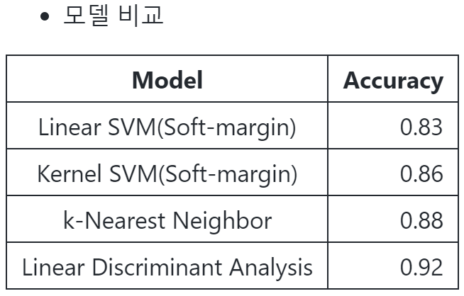

# Topic2: Kernel-based Learning

2022_Fall_Business Analytics(IME654)

두번째 주제인 커널기반 학습 Tutorial입니다. (김도현 2022020651)  
커널기반 학습의 전반적인 내용을 간략히 정리하고, SVM에 대해 tutorial을 수행해보았습니다.


## Contents
1. Kernel-based Learning  
    1. Overview
    2. SVM
        - [Original SVM](#1-1-original-svm), [SVM w/ Kernel](#1-2-svm-w-kernel)
    3. SVR
        - [Original SVR](#2-1-original-svr), [SVR w/ Kernel](#2-2-svr-w-kernel)
    4. KFDA & KPCA (Kerner Fisher Discriminant Analysis & Kernel PCA)
        - [LDA](#lda), [KFDA](#kfda)
        - [PCA](#recall-pca), [KPCA](#kpca)
2. Tutorial Note
    - [SVM Tutorial](#svm-tutorial)

---
# 1. Kernel-based Learning
## 1. Overview

커널 기반의 학습은 기존에 선형 분류기 혹은 회귀 모델인 SVM, SVR에 kernel함수를 도입함으로써 선형으로 클래스를 분류하기 어려운 경우에 해결방법으로 고려해볼 수 있다.  
현실 세계의 데이터는 기존에 저차원 공간에서 분류나 회귀가 어려운 경우가 많다. 이때 데이터를 더 높은 차원에 맵핑하면 선형(선, 초평면)으로 분류가 가능할 수 있다. 다만, 고차원으로 표현하는 과정에서 늘어나는 연산량은 크게 부담된다. 데이터를 고차원으로 맵핑하고, 데이터 요소끼리 내적해야하기 때문이다. 이를 완화하고자 한 것이 바로 Kernel trick이다.  
따라서 본 커널 기반의 학습에서는 kernel trick을 사용해 기존에 저차원 공간에서 해결하기 어려운 문제들을 고차원에 맵핑함과 동시에 간단히 연산하도록 하여 비선형의 SVM, SVR을 가능하도록 한다.
<center>

</center>

---

## 1. SVM

Support Vector Machine은 벡터 스페이스 상에 있는 데이터들을 가장 잘 나눌 수 있는 경계면을 찾는 것이 목적이다. 특히 이진 분류를 수행하는데 가장 잘 분류할 수 있는 기준으로 '마진'을 적용한다. 마진은 경계면에 의해 분류된 data point와 경계면 간의 거리들 가운데 가장 짧은 거리를 의미한다. 여기서 SVM은 해당 마진을 가장 최대화하는 경계면을 찾는 것이다.  
또한, 마진을 결정하는 기준에 따라 hard margin SVM, soft margin SVM으로 나눌 수 있다. Hard margin을 갖는 SVM의 경우 마진 내 그 어떤 객체도 들어올 수 없도록 즉, 마진을 벗어나는 것을 용납하지 않는 SVM이다. Soft margin은 마진을 조금 벗어나는 것은 용납하지만 패널티를 적용하는 SVM이다.  
기본적인 SVM은 data point들을 가장 잘 분류할 수 있는 선형 경계면을 찾는 것이다. 다만, 선형으로 분류할 수 없는 경우 kernel을 통해 데이터를 고차원에 맵핑한 뒤 분류할 수 있는 초평면을 찾는다. 이것을 Kernel SVM이라고 하며, 동일하게 hard margin soft margin으로 나눌 수 있다.
<center>

</center>

### 1-1. Original SVM

SVM은 이진분류를 위한 선을 찾는 것이 목적이다. 앞서 설명한 것과 같이 데이터의 클래스를 가장 잘 나눌 수 있는 경계면을 찾는 것인데, 경계면을 찾는 과정에서 마진 내에 객체가 있어도 되는지 안되는지에 따라 hard margin SVM, soft margin SVM 2가지의 SVM이 있다.

- hard margin을 갖는 SVM은 마진을 최대화하는 목적식과, 마진 내에 어떠한 객체도 포함되지 않도록 제약식을 가진다. 목적식으로부터 svm의 최적해를 얻는 과정에서 w와 b를 얻을 수 있게 된다. 특히 해당 과정에서 KKT 조건에 의해 마진 위에 있는 벡터들이 마진 결정에 영향을 미치게 되는데, 이것이 support vector이다.

<center>

</center> 

- soft margin을 갖는 SVM은 마진을 최대화하는 목적식이지만 조건을 만족시키지 못한 경우(마진을 벗어난 객체) 패널티 항이 추가된 목적식을 가진다. 또한 패널티항에 hyper-parameter C가 있는데, 이는 패널티를 얼마나 과중하게 볼 것인가 사용자가 판단해 설정한다. 해당 목적식을 푸는 과정도 hard margin일 때와 동일하며, 결과적으로 C에 따라 마진의 크기가 변화한다. C가 커질수록 마진은 작아지고, C가 작아질수록 마진은 커진다. 또한, 마진을 벗어난 벡터들과 마진 위에 있는 벡터들이 경계면을 결정하게 되고, 이것이 support vector가 된다.

<center>

</center> 

### 1-2. SVM w/ Kernel

데이터의 분포들에 따라 선형 경계면으로 분류하기 힘든 경우가 있다. 이런 경우 데이터를 고차원에 맵핑한 뒤, 이들의 클래스를 분류할 수 있는 경계면을 찾아볼 수 있다. 이것이 Kernel SVM이다. 이때도 마진을 어떻게 가져갈 것인지에 따라 2가지 종류가 있지만 soft margin일 경우만 살펴본다. 당연하겠지만, 해당 case가 SVM 중 실제 데이터에 대해 가장 많이 사용된다고 한다.  
목적식은 soft margin을 가지는 original SVM과 동일하지만, 입력데이터 x를 고차원에 맵핑하는 것에 차이가 있다. 목적식으로부터 최적해를 얻는 과정에서, 데이터 요소들간 내적하는 부분에 대해 kernel trick을 사용하는 것이 특징이다. 상대적으로 저차원인 공간에서 내적을 하고, 고차원공간으로 맵핑함으로써 연산량을 비교적 간단히 가져갈 수 있다. kernel trick을 위해 사용하는 kernel 함수로는 polynomial, sigmoid, gaussian kernel이 있다.  

<center>

</center>

결과적으로 비선형적인 분류를 위해 데이터를 더 고차원에 맵핑하여 고차원 공간에서 데이터를 분류할 수 있는 초평면을 찾는 것이 Kernel SVM 이라고 할 수 있다.
<center>

</center> 


---

## 2. SVR
SVR은 SVM의 regression 버전이다. Regression은 데이터가 주어졌을 때 데이터를 잘 설명하는 선을 찾고자 하는 것이다. SVR은 Riddge regression과 비슷한 목적을 가지고 있는데, 회귀계수 크기를 작게하여 회귀식을 평평하게 만들면서도 실제값과 추정값의 차이를 작도록 고려하는 일반화된 선을 찾는 것이 목적이다.  

### 2-1. Original SVR
SVR은 회귀식이 추정되면 회귀식 위아래로 입실론만큼 튜브를 생성하여, 튜브 안에 있다면 차이를 용인해주고 객체가 튜브 밖에 있다면 패널티를 부여한다. f(x)=wx+b라는 회귀선을 찾는다고 하면, 목적식은 회귀계수 w에 대해서는 robust하면서도 실제값과 추정값의 차이에 대해 loss를 부여해 이를 최소화하는 식으로 표현된다.
<center>

</center>
SVM에서와 비슷하게 w, b를 구하는 과정에서 KKT 조건에 의해 튜브선에 걸친 객체와 튜브선 바깥쪽에 위치하는 객체들이 b를 결정하게 되고, 이들이 SVR의 support vector가 된다.
<center>

</center>


### 2-2. SVR w/ Kernel
SVM에서와 마찬가지로 선형으로 적절한 회귀식을 찾을 수 없는 경우가 굉장히 많다. 동일하게 맵핑함수를 통해 저차원 데이터들을 더 높은 차원으로 변환시켜, 이들을 잘 회귀할 수 있는 선형 회귀선을 찾아볼 수 있다. original SVR의 목적식을 전개하는 과정에서 라그랑지안 듀얼 문제로 재구성하고 객체들의 내적에 대해 kernel trick을 사용해 고차원 공간으로 변형시켜준다. 결과적으로 고차원공간에 맵핑하여 비선형적인 회귀식을 도출할 수 있게 된다.
<center>

</center>

비선형성을 가지는 회귀식을 만들기 위해 데이터를 더 고차원에 맵핑하여 고차원 공간에서 데이터를 분류할 수 있는 회귀선을 찾는 것이 Kernel SVR이다.  

---

## 3. KFDA & KPCA (Kerner Fisher Discriminant Analysis & Kernel PCA)
### 3-1. KFDA
LDA에 대해서 먼저 살펴본 후, 고차원에 맵핑하여 LDA를 적용한 KFDA를 생각한다.  

### LDA
Linear Discriminant Analysis는 사영 후에 두 클래스를 가장 잘 분리하는 사영 기저를 찾는 것이다. 사영 후 원데이터가 가지는 분산을 최대화하는 PCA와 달리 LDA는 사영 후에 두 클래스를 잘 분류할 수 있어야한다는 점에서 목적이 서로 다르다.  
<center>

</center>  

이를 위해서 클래스 간 얼마나 멀리 떨어져 있는지에 대한 between class variance 지표와 클래스 내 객체들이 서로 얼마나 가까이 밀집해 있는지 within class variance 지표를 통해 아래 첫번재 수식과 같이 표현할 수 있고, 이것을 maximized 하는 게 목적이다. S_b와 S_w는 각각 between class, within class의 공분산 행렬이다. 결과적으로 클래스 사이의 방향 벡터와 within class의 공분산 행렬의 역행렬을 구하면 원하는 기저를 구할 수 있게 된다.
<center>

</center>
  

### KFDA
앞서 살펴본 LDA에 Kernel을 사용하여 더 고차원에서 클래스를 잘 분류할 수 있는 기저를 찾아볼 수 있다. 입력데이터 x를 고차원에 맵핑해서 S_w와 S_b를 구한 뒤, 원래 LDA의 목적식을 풀면 된다.
<center>

</center>

### 3-2. KPCA
PCA에도 Kernel을 적용해볼 수 있는데, PCA를 간략히 살펴보고 KPCA를 정리한다.
### (recall) PCA
PCA는 주성분 분석으로 대표적인 선형 차원 감소 기법으로써 원래 데이터의 분산을 최대한 보존하는 새로운 기저를 찾고, 그 축에 데이터를 사영시키는 기법이다. 어느 관점에서 데이터를 바라보는 것이 최적의 관점인지 알아내기 위해 PCA 알고리즘을 사용하는데, 그 기준으로 데이터들이 가진 분산을 최대한 보존하는 것이 핵심이다.

(recall) PCA의 과정은 다음과 같았다.
1. 데이터 정규화 
    - 모든 변수의 평균을 0으로 맞춤
2. 최적화 문제 정의 
    - 사영 후 데이터의 분산을 최대화하는 최적화 문제
3. 최적화 문제의 해 찾기
4. 기저 벡터의 집합 확인
    - 앞서 구한 고유벡터를 고유값 크기의 내림차순으로 정렬
    - 각 고유값에 따른 전체 데이터 분산 보존률을 보고 기저개수 결정
5. 새로운 변수 생성
    - 4단계에서 구한 기저에 원 데이터를 사영시켜 새로운 변수 생성

### KPCA
KPCA도 마찬가지로 고차원 공간으로 입력데이터를 맵핑해 분산을 최대화하는 기저를 찾는, nonlinear space의 차원축소 기법이다. 
<center>

</center>  

PCA가 데이터의 공분산으로부터 구한 eigenvector에 데이터를 사영시켰다면, KPCA는 kernel 함수를 거쳐 새로운 공간에서의 공분산으로 기저를 구하게 된다.
<center>

</center>

KPCA의 과정은 다음과 같다.
1. kernel 함수를 결정
2. kernel 함수를 적용하고 공분산 행렬 구하기
3. eigenvalue가 높은 eigenvector를 선택
4. 선택된 eigenvector에 데이터 사영  
---
# 2. Tutorial Note
## SVM Tutorial
Tutorial은 kaggle에 있는 'Credit Card Fraud Detection' 데이터를 사용하였습니다. 이번 Tutorial의 목적은 다음과 같습니다.
- navie SVM w/ soft-margin 구현
- linear SVM과 Kernel(rbf) SVM 성능 비교
- k-NN, LDA와 성능 비교  

### go to Tutorial
- [Tutorial Note](./svm_tutorial.ipynb)

### SVM solver
전체 코드 부분은 jupyer notebook을 참고할 수 있으며, SVM의 구현 부분에 대해서만 간략하게 짚고 넘어가겠습니다. SVM의 구현을 위해 원 문제의 수식을 이해할 필요가 있습니다.  
원 문제를 Lagrangian multiplier를 이용하여 Lagrangian primal로 변환하면 이 때의 dual은 다음과 같습니다.  

<center>

</center>

CVXOPT의 solver는 (P, q[, G, h[, A, b[, solver[, initvals]]]])와 같은 형태로 parameter들을 받아 아래와 같은 수식을 만족시키는 모수를 찾습니다. 여기서의 P, q, G, h, A, b를 적절하게 설정하여 cvxopt가 lagrangian dual을 풀 수 있도록 하는 것이 필요합니다.
<center>

</center>

```python
# SVM sol function
def svm_solver(X, y, C, param=0, type='linear', output_print=False):
    H = Kernel_(X, X, params=param , type_=type)*1.
    H *= y@y.T

    m,n = X.shape

    P = cvxopt_matrix(H)
    q = cvxopt_matrix(-np.ones((m, 1)))
    G = cvxopt_matrix(np.vstack((-np.eye(m), np.eye(m))))
    h = cvxopt_matrix(np.hstack((np.zeros(m), np.ones(m)*C)))
    A = cvxopt_matrix(y.reshape(1, -1))
    b = cvxopt_matrix(np.zeros(1))

    # run
    sol = cvxopt_solvers.qp(P, q, G, h, A, b)
    alphas = np.array(sol['x'])
    print('-'*70)

    # results
    w = ((y*alphas).T@X).reshape(-1,1)
    S = ((alphas > 1e-4) & (alphas < C-1e-4)).flatten()
    b = y[S] - np.sum(Kernel_(X, X[S], params=2,  type_='rbf')*y*alphas, axis=0).reshape(-1,1)

    if output_print == True:
        print('Alphas = ', alphas[(alphas > 1e-4) & (alphas < C-1e-4)])
        print('-'*70)
        print('w = ', w.flatten())
        print('-'*70)
        print('b = ', np.mean(b))
        print('-'*70)
        print("support vector: ", np.array(range(m))[S])
    else:
        pass
    
    return alphas[(alphas > 1e-4) & (alphas < C-1e-4)], w.flatten(), np.mean(b), np.array(range(m))[S]
```

### Results



SVM의 수식을 참고해 코드로 구현하였습니다. 또한, 분류 task에 많이 사용되는 몇몇의 알고리즘과 SVM과 비교를 수행했습니다.    
- 가장 좋은 성능을 보이고 있는 모델은 LDA로 Kernel을 사용하지 않았음에도 더 좋은 성능을 보였습니다.
- SVM은 RBF Kernel을 사용한 모델이 사용하지 않은 모델보다 성능이 0.03 더 좋은 결과를 보입니다.
    - 추가적으로 gamma와 C를 바꿔가며 실험해보았지만, 실제로 큰 성능 변화는 없었습니다.
    - 데이터의 특성상 고차원 맵핑이 필요하지 않을 수도 있습니다. 
- 다만, original data는 신용카드 부정사용 탐지 데이터로 class 불균형이 있어, 분석자가 임의로 클래스 개수를 맞춰주었기 때문에 불균형의 문제는 여전히 남아있을 것으로 판단됩니다.