# Topic3: Anomaly Detection

2022_Fall_Business Analytics(IME654)

비즈니스애널리틱스 세번째 주제인 이상치 탐지 Tutorial입니다. (김도현 2022020651)  
이상치 탐지에서 배운 내용들에 대해 간략히 정리하고, tutorial을 수행해보았습니다.

## Contents
1. Anomaly Detection
    1. Overview
    2. Density-based Anomaly Detection
        - [Gaussian Density-based Anomaly Detection](#1-1-gaussian-density-based-anomaly-detection)
        - [Mixture of Gaussians](#1-2-mixture-of-gaussians)
        - [Parzen Window Density Estimation](#1-3-parzen-window-density-estimation)
        - [Local Outlier Factor](#1-4-local-outlier-factor)
    3. Distance-based Anomaly Detection
        - [k-Nearest Neighbor-based Anomaly Detection](#2-1-k-nearest-neighbor-based-anomaly-detection)
        - [Clustering-based Approach](#2-2-clustering-based-approach)
        - [Principal Component Analysis-based Anomaly Detection](#2-3-principal-component-analysis-based-anomaly-detection)
    4. Model-based Anomaly Detection
        - [Auto-Encoder](#3-1-auto-encoder)
        - [Support Vector-based Anomaly Detection](#3-2-support-vector-based-anomaly-detection)
        - [Isolation Forersts](#3-3-isolation-forersts)
2. Tutorial Note
    - [Anomaly Detection Tutorial](#anomaly-detection-tutorial)

---
# 1. Anomaly Detection
## 1. Overview
이상치 데이터란 관찰된 데이터들 가운데 일반적인 분포에서 벗어나 다른 메커니즘에 의해 생성된 것과 같이 의심되는 데이터이다. 이상치 데이터를 Anomaly 혹은 Novel data라고 부르는데, 탐지하고자 하는 데이터가 긍정인지 부정인지에 따라 다르게 부른다. 긍정적인 목적으로 특이한 데이터를 잡아내고자 할 때는 novel detection, 부정적인 목적으로 잡아내고자 할 때는 anomlay detection이라 할 수 있다. 다만, 이상치 데이터와 노이즈 데이터는 다르다. 기본적으로 데이터에 존재하는 노이즈는 제거할 수 없는 영역이다.  
이상치 탐지는 실제 산업현장에서 많이 적용되는 알고리즘인데, 대표적으로 제조업에서의 불량 탐지, 컴퓨터 로그 기록으로부터 이상 로그 탐지, 부정 카드 사용 탐지 등에 사용된다고 한다.  

---
## 2. Density-based Anomaly Detection
밀도 기반의 이상치 탐지 방법은 정상 범주의 데이터들을 생성하는 특정 함수가 정해져 있고, 분포를 결정해주는 핵심 요소가 있을 것이라 가정한 접근 방법이다. 주어진 제이터를 바탕으로 각 객체들이 생성될 확률을 추정해 추정된 분포로부터 가장 낮은 확률을 가지는 데이터를 이상치로 탐지한다.  
아래 살펴볼 4개의 방법론 중, Gaussian Density-based Anomaly Detection과 Mixture of Gaussians는 데이터가 특정 분포를 따른다고 가정하고 접근하는 방법론이다. 반면, Parzen Window Density Estimation과 Local Outlier Factor의 경우에는 데이터가 특정 분포를 따른다고 가정하지 않고 접근한다.

### 1-1. Gaussian Density-based Anomaly Detection
가우시안 기반의 이상치 탐지 방법론은 모든 데이터가 하나의 가우시안 분포로부터 생성되는 것을 가정하여 접근하는 방법론이다. 관찰된 데이터를 통해 가우시안 분포의 파라미터(평균, 분산)와 공분산 행렬을 추정하고, 이후 새로운 데이터에 대해서는 앞서 추정한 가우시안 분포에 따른 생성 확률을 구해 이상치를 판단한다. 분포로부터 확률이 낮을수록 이상치에 가까운 것으로 판단하게 된다.  

$$
p(x) = {{1}\over{(2\pi)^{d/2}|\sum^{1/2}}}exp[{{1}\over{2}}(x-\mu)^T\sum ^{-1}(x-\mu)]
$$

평균 벡터와 공분산 행렬은 아래의 수식에 따라 구할 수 있다.

$$
\mu = {{1}\over{n}}\sum_{x_i\in X^+} x_i
$$

$$
\sum = {{1}\over{n}}\sum_{x_i\in X^+} (x_i-\mu)(x_i-\mu)^T
$$

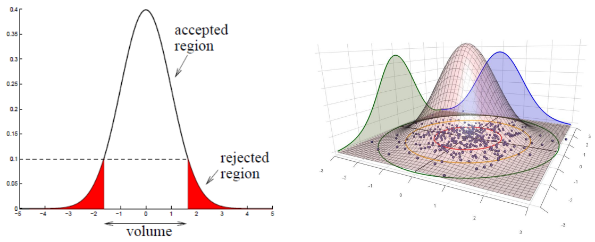

  
  
### 1-2. Mixture of Gaussians (MoG)
관찰된 데이터들에 대해 하나의 가우시안을 따른다고 가정하면, 복잡한 데이터의 분포는 잘 표현하지 못한다는 단점이 존재한다. MoG는 하나의 가우시안이 아닌 여러 개의 가우시안이 혼합된 분포를 따른다고 가정하는 방법론이다. 가우시안 분포들의 선형 결합으로 전체 데이터의 분포를 표현한다. 예를 들어 데이터들이 아래의 가우시안 분포들(보라, 초록, 하늘색)을 따른다고 가정했을 때 f(x)는 이 3개의 분포들의 선형결합으로써 표현할 수 있다.

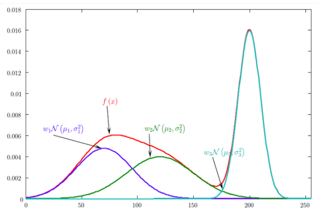

데이터 객체가 MoG를 따를 확률은 아래 첫번째 수식과 같고, 이때의 각 가우시안의 분포를 추정해 전체 분포를 추정하게 된다.
$$
p(x|\lambda )=\sum_{ m=1 }^{M}{{ w }_{ m } g(x|{ \mu  }_{ m },{\sum}_{ m }})
$$
$$
g(x|{ \mu  }_{ m },{ \sum   }_{ m })=\frac { 1 }{ { (2\pi ) }^{ d/2 }{ |{ \sum   }_{ m }| }^{ 1/2 } } exp[\frac { 1 }{ 2 } (x-{ \mu  }_{ m })^{ T }{ { \sum   } }_{ m }^{ -1 }(x-{ \mu  }_{ m })]
$$
MoG에서 전체 가우시안 분포의 추정을 위해서 Expectation-Maximization 알고리즘을 사용한다. 먼저, 현재의 파라미터를 고정했을 때의 분포에서의 확률 값을 계산하여 각 객체가 분포마다의 확률 값들을 구한 뒤(E-step), 이때의 우도를 최대화하는 파라미터를 찾아 업데이트한다(M-step).  

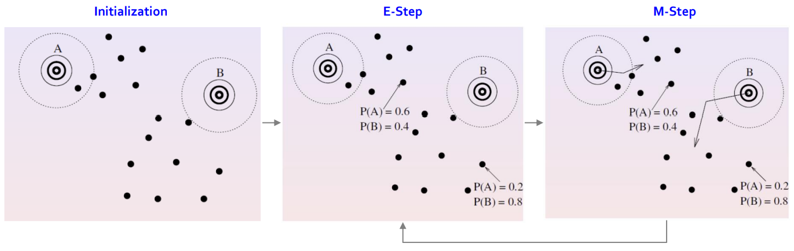

  
아래 첫번째 수식을 통해 고정된 파라미터에서 각 가우시안 분포에서 나타날 확률을 계산한다. 이후 구한 m을 고정한 상태에서 두번째 수식으로 파라미터들을 최적화한다.  
$$
p(m|{ x }_{ i },\lambda )=\frac { { w }_{ m }g({ x }_{ i }|{ \mu  }_{ m },{ m }_{ m }) }{ \sum _{ k=1 }^{ M }{ { w }_{ k }g({ x }_{ t }|{ \mu  }_{ k },{ m }_{ k }) }  }
$$
$$
{ w }_{ m }^{ (new) }=\frac { 1 }{ N } \sum _{ i=1 }^{ N }{ p(m|{ x }_{ i },\lambda ) }
$$
$$
{ \mu  }_{ m }^{ (new) }=\frac { p(m|{ x }_{ i },\lambda ){ x }_{ i } }{ \sum _{ i=1 }^{ N }{ p(m|{ x }_{ i },\lambda ) }  }
$$
$$
{ \sigma  }_{ m }^{ 2(new) }=\frac { \sum _{ i=1 }^{ N }{ p(m|{ x }_{ i },\lambda ){ x }_{ i }^{ 2 } }  }{ \sum _{ i=1 }^{ N }{ p(m|{ x }_{ i },\lambda ) }  } -{ \mu  }_{ m }^{ 2(new) }
$$

### 1-3. Parzen Window Density Estimation
앞서 살펴본 방법론과는 달리, Parzen Window 방법론은 데이터가 특정한 분포를 가진다는 가정 없이 주어진 데이터로부터 주변부의 밀도를 추정하는 방식이다. 이에 앞서 먼저 Kernal-density Estimation에 대해 살펴볼 필요가 있다. Kernel density Estimation은 원점을 중심으로 대칭이면서 넓이가 1인 함수로 정의되는 커널함수를 사용해 데이터의 밀도를 추정한다.  
먼저 임의의 확률 밀도 함수에서 x가 표본 공간에서 R 영역에 있을 확률은 아래 첫번째 수식과 같고, 주어진 데이터들 가운데 k개가 범위 안에 속할 확률은 두번째 수식과 같이 구할 수 있다.
$$
P=\int _{ R }^{  }{ p({ x }^{ \prime  })dx^{ \prime  } }
$$
$$
P(k)=\left( \begin{matrix} N \\ k \end{matrix} \right) { P }^{ k }(1-P)^{ N-k }
$$
이때의 평균과 분산을 다음 수식과 같이 구할 수 있고, 데이터의 수(N)가 커지게 되면 분산은 0으로 수렴하게 된다. 
$$
E(k)=NP\rightarrow E\left[ \frac { k }{ N }  \right] =P
$$
$$
Var(k)=NP(1-P)\rightarrow Var\left[ \frac { k }{ N }  \right] =\frac { P(1-P) }{ N }
$$
N이 무한대에 가까워지면 분산은 결국 0이 되어버리고, R 영역에 대한 확률은 $P \cong {{k}\over{N}}$ 이 된다. 이때 R 영역의 크기가 매우 작다고 하면 다음의 가정이 성립한다.
$$
P = \int_R p(x^{\prime})dx^{\prime} \cong p(x)V = {{k}\over{N}}
$$
$$
p(x)={{k}\over{NV}}
$$
이 수식이 의미하는 바는 확률밀도의 추정은 데이터의 샘플 수(N)가 많을수록, 영역의 크기(V)가 작을수록 정확해진다는 것이다. 실제 적용에서는 데이터의 수가 고정되어 있기 때문에 적절한 V를 찾아야 하는데, 이때 영역 R 내부에 충분한 데이터가 포함되도록 해야하면서도 확률의 변동이 없도록 영역 R은 작아야 한다. 즉, V는 고정이고 k를 찾는 것이 커널 밀도 추정의 핵심 문제이다.  
Parzen window는 이 영역 R을 k개의 샘플을 담는 hypercube로 정의한 커널함수이다. 이 hypercube의 중앙을 x라고 하고 한변의 길이를 h라 할 때, $h^d_n$ 의 부피를 가지는 hypercube를 가지고 데이터의 밀도를 추정하는 것이다.
$$
p(x)=\frac { 1 }{ N{ h }^{ d } } \sum _{ i=1 }^{ N }{ K(\frac { { x }^{ i }-x }{ h } ) }
$$
하지만 hypercube 내에 객체가 위치하면 1 영역 밖이면 0이고, 안에 존재하더라도 객체들에 대해 가중치가 동등하기 때문에 불연속적인 추정이다. 따라서 다른 방식의 커널함수를 사용해 밀도를 추정한다.

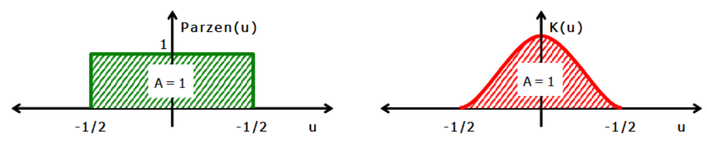

### 1-4. Local Outlier Factor
Local Outlier Factor는 이상치 스코어를 산출할 때, 주변주 데이터의 밀도를 고려하는 기법이다. 예를들어, 아래의 그림과 같은 데이터에서 노란색으로 표시한 두 점을 선택했다고 가정해보겠다. 이때 왼쪽 아래 위치한 점의 부근에 위치한 데이터들은 밀도가 높고, 오른쪽 위에 위치한 점은 부근에 있는 데이터들의 밀도가 sparse하다. 이때 주변부의 밀도를 고려해 이상치 점수를 매기는 것이 해당 알고리즘의 특징이다. 선택된 두 점이 주변의 데이터와 절대적인 거리는 비슷하지만, 주변부의 데이터 밀도에 따라 이상치 정도를 다르게 부여하는 것이다.

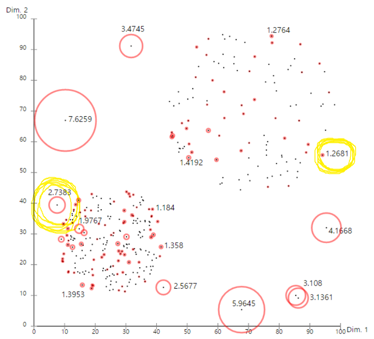

  
알고리즘 프로세스는 다음과 같다. 먼저 객체 p의 주변 객체 k과의 거리 k-distance를 구한다. 이후 k-disteance 범위 안에 있는 데이터 중 두 객체 사이의 거리와 k-distance를 비교해 사용가능한 더 큰 값 reachability distance을 구한다. 이때 객체p의 local reachability distance를 다음과 같이 정의할 수 있다.
$$
lrd_{ k }(A)=\frac { |{ N }_{ k }(p)| }{ \sum _{ O\in { N }_{ k }(p) } reachability-distance_{ k }(p,o) }
$$
객체 p가 밀도가 높은 부분에 위치하면 분모가 작아지면서 reachability distance 값은 커지고, 객체 p가 밀도가 낮은 부분에 위치하면 반대로 작용한다. 이후 최종적으로 LOF 점수는 다음의 수식으로 구할 수 있다. 객체 p의 이상치 점수를 의미한다고 할 수 있다.
$$
{ LOF }_{ k }(p)=\frac { \sum _{ o\in { N }_{ k }(p) }^{  }{ \frac { lrd_{ k }(o) }{ lrd_{ k }(p) }  }  }{ |{ N }_{ k }(p)| } =\frac { \frac { 1 }{ lrd_{ k }(p) } \sum _{ o\in { N }_{ k }(p) }^{  }{ lrd_{ k }(o) }  }{ |{ N }_{ k }(p)| }
$$

## 3. Distance-based Anomaly Detection
이번 챕터에서는 거리기반으로 이상치를 탐지하는 기법들에 대해 간략히 설명해본다.

### 3-1. k-Nearest Neighbor-based Anomaly Detection
k-NN 기반 이상치 탐지 방법은 이름에서 볼 수 있듯이 최근접 이웃 k-NN을 응용한 것이다. k-NN은 공간 R에 객체들이 분포하고 있다고 할 때, 특정 객체는 k개의 최근접한 이웃 객체들의 주된 범주에 의해 결정되는 알고리즘이다.  
이상치 탐지에서는 k개의 최근접 이웃들과의 거리 정보를 기반으로 이상치 점수를 계산한다. 계산된 이상치 점수와 다른 데이터들과 비교해 이상치를 판단한다. 이웃들과의 거리 정보는 3가지의 지표가 있는데, 최대거리, 이웃 객체들과의 평균거리, 이웃 객체들과 평균거리와의 거리를 이용해 이상치 점수를 구할 수 있다. 하지만 실제 적용에는 한계점이 있어 이웃들간의 convex 거리, convex hull 거리 등 추가적인 거리정보를 이용해 이상치 점수를 구해 이상치를 탐지한다.

### 3-2. Clustering-based Approach
클러스터링 기반 접근법 가운데 k-means를 응용한 이상치 탐지 기법에 대해 간략히 정리해본다. k-means의 알고리즘은 다음과 같다. 먼저, 사전에 정의된 k개의 군집수에 따라 군집의 중심이 될 k개의 점을 데이터 중에서 임의로 선택한다. 이후 유클리드 거리를 이용해 데이터 포인트들 각각을 가까운 군집에 할당하고 각 군집에 속한 객체들의 평균을 계산한다. 계산된 평균을 중심으로 다시 데이터 포인트들을 재군집화하고 다시 평균을 구하는 프로세스를 변화가 없을 때까지 반복하는 알고리즘이다.  
k-means 이상치 탐지는 객체와 가장 가까운 군집의 중심과의 절대거리, 군집의 지름을 이용하여 이상치 점수를 계산하는 기법이다.  

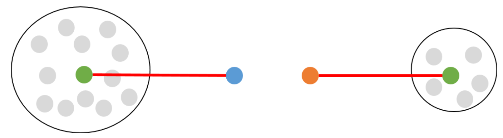

### 3-3. Principal Component Analysis-based Anomaly Detection
PCA를 이용한 이상치 탐지 방법이다. PCA는 앞선 topic1에서 살펴보았듯이, 주어진 데이터들의 분산을 최대로 보존할 수 있는 주성분을 찾는 기법이다. 이때 분산을 최대한 보존할 수 있도록 하는 기저에 사영해 데이터의 차원을 축소하게 되는데, 축소된 차원 공간과 원데이터 공간 사이의 에러를 이상치 점수로 두는 방법이다. 즉, PCA를 사용해 데이터를 차원축소하고, 이를 다시 복원했을 때 원데이터와 비교해 복원 정도를 가지고 이상치를 탐지하는 기법이다.

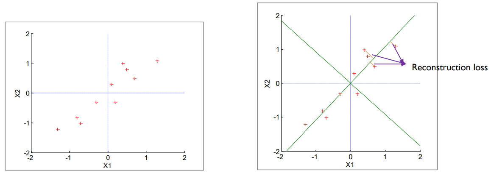

## 4. Model-based Anomaly Detection
앞서 밀도, 거리 기반 이상치 탐지 방법론들을 살펴보았다면, 지금부터는 모델 기반의 이상치 탐지 방법론들에 대해 살펴본다.  

### 3-1. Auto-Encoder
AutoEncoder는 입력변수의 수보다 은닉 노드의 수가 더 적은 은닉층을 가지면서 입출력이 동일한 신경망이다. 이때 Autoencoder에 데이터를 학습시키면 encoder는 데이터의 특정 패턴을 학습해 잘 압축하려고 할 것이고, decoder는 압축된 벡터의 정보를 이용해 원 데이터와 최대한 비슷하게 출력해내도록 학습한다.

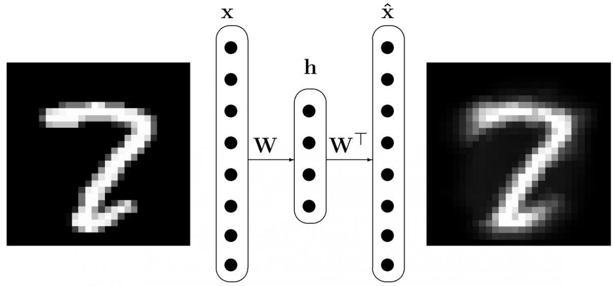

이러한 특성을 이용해 이상치 탐지에 사용할 수 있는데, 정상 데이터들을 학습한 autoencoder는 이상 데이터가 들어왔을 때에도 정상 데이터와 비슷하게 복원하려고 할 것이다. 이때 입력된 이상 데이터와 복원된 데이터와의 차이는 정상 데이터를 입력으로 주었을 때보다 클 것이다. 이처럼 입력과 출력물의 차이 값을 이용해 정상과 비정상을 판단하는 것이 autoencoder기반 이상치 탐지 방법이다.  

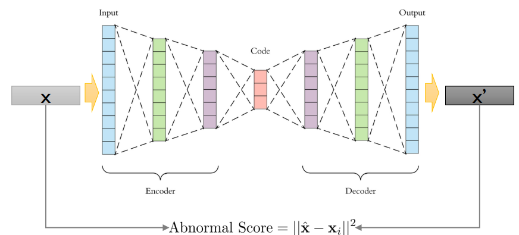

추가로 autoencoder에 encoding 과정에서 노이즈를 준 뒤에 원본과 같이 복구하도록 하는 denoising AutoEncoder, Convolution 연산을 활용해 이미지 데이터의 이상치를 탐지하는 Convolutional AutoEncoder 등을 활용한 이상치 탐지 방법들도 있다.  

### 3-2. Support Vector-based Anomaly Detection
Support Vector 기반의 이상치 탐지 방법으로는 1-SVM과 SVDD를 살펴본다. 1-SVM은 데이터를 피처공간에 매핑하고 원점과의 거리를 최대화할 수 있는 초평면을 찾는 것이 목적이다. 목적식은 SVM과 비슷한 걸 확인할 수 있다. 다만, 1-SVM은 $-\rho$ 를 통해 초평면이 원점으로부터 양의 방향으로 최대한 멀어지라는 제약과, ${{1}\over{\nu l}}\sum\xi_i$ 를 통해 초평면 아래에 존재하는 객체들에 대해 패널티를 가하도록 제약하는 부분이 추가된다. 
$$
min_w  \frac{1}{2}\ \lVert w\rVert ^2+ \frac{1}{\nu l}\sum_{i=1}^l\xi_i-\rho\\
s.t. \quad \mathbf{W}\cdot\boldsymbol{\Phi}(\mathbf{X_i})\ge\rho-\xi_i\\
i=1,2,...,l, \qquad \xi\ge0\\
$$
해당 목적식으로부터 decision function을 구하면 아래와 같으며, 새로운 데이터가 입력되었을 때 함수값이 +이면 정상데이터로 -이면 비정상 데이터로 분류하게 된다.
$$
f(\mathbf{X_i})= sign(\mathbf{W}\cdot\mathbf{\Phi(\mathbf{X_i})-\rho})
$$

Support Vector는 초평면 아래에 위치한 객체와 초평면 위에 위치한 객체들이다. 또한, 목적식에서 $\nu$ 를 작게 잡을 경우 정상영역의 범위가 더 넓게 형성되고, 크게 잡을 경우 정상영역의 범위가 더 좁게 형성된다. SVM과 마찬가지로 kernel trick을 사용해서 고차원에서 초평면을 탐색해볼 수도 있다.

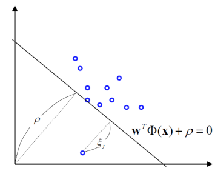

SVDD는 정상 데이터를 둘러싸는 가장 작은 초구를 찾는 것이 목적이다. 따라서 목적식을 살펴보면 초구의 반지름을 최소화하는 구조이며, 원이 너무 작아지는 것을 방지하기 위해 class로 인정받지 못하는 샘플을 최소화하도록 제약을 추가한다. 다만, 초구를 벗어난 객체와의 거리를 정확하게 계산할 수 없기 때문에 벗어난 것에 대해 패널티를 부여하기만 한다.
$$
min_{R,\mathbf{a},\xi_i} R^2 + C\sum_{i=1}^l\xi_i\\

s.t. \lVert \mathbf{\Phi(\mathbf{X_i})-\mathbf{a}} \rVert^2 \le R^2+\xi_i, \quad \xi_i\ge0,\; \forall i
$$
해당 목적식으로부터 decision function을 구하면 아래와 같으며, 새로운 데이터가 입력되었을 때 함수값이 +이면 정상데이터로 -이면 비정상 데이터로 분류하게 된다.
$$
f(\mathbf{X})=sign(R^2-\lVert \mathbf{\Phi(\mathbf{X_i})-\mathbf{a}} \rVert^2)
$$
SVDD의 Support Vector는 초구 밖에 위치한 객체와 초구 위에 위치한 객체들이다. 마찬가지로 kernel trick을 적용해 고차원에서 초구를 탐색해볼 수 있다.

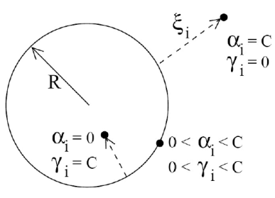

### 3-3. Isolation Forersts
I-Forest는 소수 범주의 데이터(이상치)는 정상 범주 데이터와는 특정 속성 값이 많이 다를 가능성이 높다는 가정으로부터 시작한다. 속성 값이 다른 하나의 객체를 고립시키도록 tree를 생성하는 방법론이다. 가정이 맞다면, 아래 그림의 왼쪽과 같은 정상 데이터를 고립시키는데는 많은 분기(split)가 필요할 것이고 오른쪽 그림과 같은 이상치 데이터라면 상대적으로 적은 분기만으로 고립이 가능할 것이다.

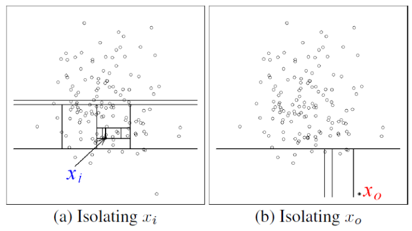

이상치 점수는 해당 객체의 고립까지 분기를 얼만큼 수행했는지에 대한 정보를 사용한다. 앞서 경로 길이를 구해야하며, 경로 길이는 root node로부터 이상치 x가 속한 말단 노드까지 도달하기 위해 거쳐간 edge의 수로 정의된다.
$$
c(n) = 2H(n-1)-{{2(n-1)}\over{n}}, \quad \quad H(i) = ln(i)+0.5772156649 \; (Euler's constant)
$$

경로 길이 정보를 이용해 이상치 x의 이상치 스코어 s는 다음과 같이 정의된다. root node에서 경로 길이가 짧을수록 이상치 스코어는 1에 가까워지고, 멀어질수록 이상치 스코어는 0에 가까워진다.

$$
s(x,n)=2^{-{{E(h(x))}\over{c(n)}}}
$$

I-Forest의 장점은 이상치 스코어가 항상 0~1 사이의 값으로 계산되기 때문에, 서로다른 데이터셋에 속한 객체들 사이에 이상치 해석에 비교적 용이하다는 장점이 있다.

---
# 2. Tutorial Note
## Anomaly Detection Tutorial
Tutorial은 모델 기반의 이상치 탐지 가운데, AutoEncoder를 활용한 방법론들에 대해 구현해보고 비교해봅니다. 데이터는 CIFAR-10 데이터셋을 활용하여 하나의 클래스에 대해 autoencoder를 학습시킨 뒤, 다른 클래스의 사진을 입력했을 때의 결과를 살펴보았습니다.

이번 Tutorial의 목적은 다음과 같습니다.
- naive AutoEncoder, Denoising AutoEncoder, Stacking AutoEncoder, Stacking Denoisign AutoEncoder 구현
- CIFAR-10 데이터셋의 하나의 클래스 이미지를 학습한 뒤, 다른 클래스 이미지를 입력했을 때의 결과 비교
- hidden node의 시각화

### go to Tutorial
- [Tutorial Note]()

