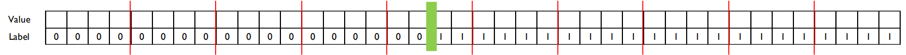

# Topic4: Ensemble Learning

2022_Fall_Business Analytics(IME654)

비즈니스애널리틱스 네번째 주제인 앙상블 학습 Tutorial입니다. (김도현 2022020651)  
앙상블 학습에서 배운 내용들에 대해 간략히 정리하고, tutorial을 수행해보았습니다.

내용 정리는 강필성 교수님의 비즈니스애널리틱스 수업 강의자료를 바탕으로 작성하였습니다.

## Contents

1. Ensemble Learning
   1. Overview
   2. Bagging & Random Forest
      - [Bagging](#1-2-1-bagging)
      - [Random Forest](#1-2-2-random-forest)
   3. Boosting-based Ensemble
      - [AdaBoost](#2-3-1-adaboost)
      - [Gradient Boosting Machine](#2-3-2-gradient-boosting-machine-gbm)
      - [XGBoost](#2-3-3-xgboost)
      - [LightGBM](#2-3-4-lightgbm)
      - [CatBoost](#2-3-5-catboost)
2. Tutorial Note
   - [Ensemble Learning Tutorial](#ensemble-learning-tutorial)

---

# 1. Ensemble Learning

## 1. Overview

Ensemble(앙상블)은 원어로는 '조화'라는 의미를 가지는 단어입니다. 각 구성을 잘 조합해서 조화롭게 만들어보자는 것이다. 머신러닝에서의 앙상블은 어느정도 훌륭한 성능을 가지는 알고리즘들을 가져와 앙상블해서 예측하면 개별 알고리즘 간의 단점을 보완해 조금이라도 성능을 더 높여볼 수 있다.

이론적으로 각 모델의 기대에러가 0이고 서로 독립이라고 가정한다면, 앙상블을 통한 예측에 대한 기대 오류를 계산해보면 각 모델의 오류에 대한 평균보다 ${{1}\over{M}} 줄일 수 있다. 특히 개별모델이 독립적이지 않더라도 코시 부등식에 따라 계산해보면 앙상블한 경우의 기대에러가 더 낮은 것을 확인할 수 있다.

$$
E_{Avg} = {{1}\over{M}} \sum_{m=1}^{M}E_x[\epsilon_m(x)^2]
$$

앙상블은 크게 2가지 기법이 있는데, Bagging(배깅)과 Boosting(부스팅) 방법이 있다. 모델의 예측이 비교적 일관되지만 정답과는 살짝 빗나가있는 경우를 bias가 있다고 하며, 정답과는 비교적 가까이 있지만 모델마다 일관되지 않는 경우에 variance가 있다고 한다. 이때 아래 그림과 같이 variance가 높은 경우를 보완하기 위해 배깅기법을 사용할 수 있고, bias가 높은 경우 부스팅 기법을 사용해 보완해볼 수 있다.

<p align="center"></p>

---

## 1-2. Bagging & Random Forest

전술한 것과 같이 배깅은 학습 데이터가 달라짐에 따라 bias가 낮고 variance가 높을 때 사용하면 효과를 볼 수 있는 기법이다. 이에 배깅은 매번 학습데이터를 랜덤 복원 샘플링하여 학습데이터를 계속해서 재구성하고 이를 병렬적으로 처리하고 결합해 최종 예측한다.

<p align="center"></p>

### 1-2-1. Bagging

배깅 이전에는 학습데이터를 다양하게 확보하기 위해 k-fold data split의 비복원 추출 기법을 고려해볼 수 있었다. 하지만, 결국 각 모델 간에 $K-2$개의 데이터는 공유되므로 데이터의 다양성을 확보하는데는 어렵다는 단점이 존재했다. 이에 bootstraping(부트스트래핑) 방식의 sampling(샘플링)을 통해 다양성 데이터 subset을 구축해 각 모델이 예측하도록 한다. 한번의 부트스트래핑으로 샘플링된 데이터들의 집합은 부트스트랩이라 부른다. 부트스트래핑 방법은 또한 복원 추출하기 때문에 학습 데이터를 충분히 많이 확보할 수 있다는 장점이 있다.

<p align="center"></p>

예측에 대한 평가 데이터 확보는 Out of Bag(OOB) 데이터로 수행할 수 있는데, 복원추출하더라도 이론적으로 약 1/3정도는 각 부트스트랩에 한번도 선택되지 않기 때문에 이를 OOB라고 한다.

$$
p = (1-{{1}\over{N}})^N  \quad \to \lim_{N \to \inf} (1-{{1}\over{N}})^N = e^{-1}
$$

각 부트스트랩에 대해 모델이 예측한 결과를 결합해서 최종 결과를 예측하는데, 결합 방식에는 여러가지 종류가 있다. 가장 많은 예측 결과로 최종 예측을 수행하는 Majority voting 방식과, 최종 예측을 결합하는데 각 모델의 training acc.를 가중치로 사용하는 방식, 모델이 각 클래스에 대한 예측확률을 가중치로 사용하는 방식 등이 있다.

### 1-2-2. Random Forest

Random Forest는 의사결정나무 기반 앙상블로 배깅 기법의 일종이다. 여러개의개의 의사결정나무를 만들고, 만든 각 tree의 결과를 결합해 최종 결과를 예측하는 방법론이다. Random Forest에서는 앙상블의 다양성을 확보하기 위해 배깅과 ‘Randomly chosen predictor variables’를 사용한다. 즉, 각 tree별로 학습데이터를 다르게 구성하고, 의사결정나무에서 node의 분류에 있어 사용할 변수를 랜덤하게 선택하여 모델의 다양성을 확보하도록 했다. 이름대로 일부의 변수만을 선택하여 정보량이 최고인 지점을 탐색합니다. 특히 논문의 저자들은 $\sqrt D$개를 임의로 선택하는데 효과적이었다고 한다.

Random Forest는 앙상블 규모가 충분히 크다면, 일반화 오차의 상한을 다음과 같이 구할 수 있다. 여기서 $\bar\rho$는 각 트리 사이의 상관계수의 평균이고, $s^2$은 각 클래스간 확률 간의 마진을 의미한다. 수식을 통해 트리 사이의 상관관계가 적을수록 로우가 줄어들어 일반화 오차가 감소하게 되는 것을 알 수 있다.

$$
Generalization error \; \leq \; {{\bar\rho(1-s^2)}\over{s^2}}
$$

랜덤 포레스트는 간접적인 방식으로 특정 변수의 중요도를 측정할 수 있다. 먼저, 원래 데이터 집합에 대해 OOB error를 구하고, 다음 단계로 특정 변수의 값을 임의로 섞인 데이터 집합에 대해 OOB error를 산출한다. 이때 2단계와 1단계 OOB error의 평균과 분산을 고려해 개별 변수의 중요도를 구할 수 있다. 다만, 이는 변수들간 상대적인 중요도를 나타내며 절대적인 의미를 가지진 않는다.

## 2-3. Boosting-based Ensemble

Boosting(부스팅)은 weak learner(약한 모델)들을 여러개 결합하여 예측 성능을 높이고자 하는 앙상블 기법이다. 약한 모델은 랜덤한 추측보다는 조금 더 나은 성능을 보이는, 정확도가 60% 정도 되는 모델들은 의미한다. 부스팅을 통해 모델이 학습 데이터에 너무 편향되지 않도록, 약한 모델을 여러개 결합하여 결과를 종합하는 것이 아이디어이다.

### 2-3-1. AdaBoost

AdaBoost는 단계마다 예측에 실패한 객체에 가중치를 부여해 단계가 지날수록 예측 성능을 높이고자 하는 기법이다. AdaBoost의 알고리즘을 살펴보면 다음의 순서와 같다.

1. 첫번째 데이터셋을 uniform 분포 $D_1(i)$ 로 구성하고, t번째 모델 $h_t$는 분포 $D_t(i)$ 를 가지고 학습하게 되며 학습과정에서의 얻은 가중치로 분포가 결정되게 된다. 이때 모델은 보통 stump tree와 같은 약한 모델을 사용한다.
2. $h_t$의 결과로부터 $\epsilon_t$와 $\alpha_t$를 계산하는데, $\epsilon_t$는 학습 데이터셋 중 모델 $h_t$가 틀린 데이터 객체의 비율이다. 그리고 $\alpha_t$는 아래 식에 $\epsilon_t$를 대입해 구한다. 다만, 랜덤 예측보다 성능이 떨어질 경우 $epilon_t \leq 0.5$이면 break 된다.

$$
\alpha_t = {{1}\over{2}}ln({{1-\epsilon_t}\over{\epsilon_t}})
$$

$alpha_t$는 모델이 예측을 잘 했다면 커지게될 것이고, 랜덤한 예측과 비슷하다면 0에 가까워진다.

3. 다음 학습 스텝 t+1번째의 학습에 사용할 데이터의 분포 $D_{t+1}(i)$는 다음의 식으로 구해 데이터를 구성한다.

$$
D_{t+1}(i) = {{D_t(i)exp(-\alpha_t y_i h_t (x_i))}\over{Z_t}}
$$

우변을 보게되면, 만약 모델이 예측에 실패한 데이터 객체는 무조건 1보다 큰 값을 곱하게 된다. 특히 모델의 성능이 좋을수록 가중치는 더욱 커지게 된다. 따라서 해당 객체는 t+1 분포에 포함될 확률이 높아지게 된다. 반대로 맞춘 데이터 객체는 무조건 1보다 작은 값이 곱해진다.

| $exp(-\alpha_t y_i h_t (x_i))$ | $\alpha_t \gg 0$ | $\alpha_t \approx 0$ |
| ------------------------------ | ---------------- | -------------------- |
| $y_i=h_t(x_i)$                 | $\approx 0$      | $<1$                 |
| $y_i \ne h_t(x_i)$             | $\gg 1$          | $>1$                 |

1~3단계의 과정을 T번 반복한 다음 각 단계에서 구해진 가중치 $\alpha_t$와 예측 값 $h_t(x)$을 모두 더해서 최종 예측을 수행한다. 아래와 같은 수식으로 최종 예측을 수행한다.

$$
H(x^{\prime}) = sign(\sum_{t=1}^{T} \alpha_t h_t (x^{\prime}))
$$

### 2-3-2. Gradient Boosting Machine (GBM)

Gradient Boosting Machine(GBM)은 Gradient descent를 도입한 부스팅 기법이다. 앞선 AdaBoost는 오답에 가중치를 부여했다면, GBM은 잔차를 최소화하도록 하는데 목적이 있다. 핵심 아이디어는 틀린 부분만큼을 다음 모델에 전달해주고 그만큼만 해결하도록 했다고 보면 된다.

$$
\begin{align*}
 y &=f_1(x) \\ y - f_1(x) &= f_2(x) \\ y-f_1(x)-f_2(x) &= f_3(x)
\end{align*}
$$

위의 수식과 같이 학습을 거듭하게 되면, 잔차는 계속해서 줄어들고 t번째의 잔차는 가장 작을 것이다.

$$
y = f_1(x)+f_2(x)+f_3(x)+...+f_t(x)+R_t
$$

단계를 거듭할수록 손실 함수를 통해 기울기가 최소화되는 방향으로 모델이 생성되고 학습을 해나간다. 따라서 어떤 손실함수를 사용하는지에 따라 최종 생성되는 함수가 달라진다. 대표적으로 회귀 문제에서는 squared loss($L_2$) loss를 사용하며, 분류 문제일 경우 Bernoulli 혹은 Adaboost loss를 사용한다.  
다만, GBM은 과적합에 대한 문제를 가지고 있는데, 함수 $F(x)$ 를 fit하고 싶은 것임에도 반복을 거듭할수록 오차 $\epsilon$ 까지 잔차로 인식해 근사해버리는 문제가 있습니다. 이를 완화하기 위해 Subsampling, Shrinkage 방법을 통한 Regularization을 고려해볼 수 있다.

- Subsampling: 학습 데이터의 일부분만 사용하는 방법으로 dropout과 같은 효과를 줌. 원래의 데이터셋을 학습한 첫번째 모델 이후는 원래의 데이터셋을 전부 사용하지 않고 일부만 추출해서 학습하는 방법.
- Shrinkage: 다음에 생성되는 모델의 영향력을 줄여주는 방법. 아래 수식의 $\lambda$ 를 조정하여 뒤쪽에 생성되는 모델의 영향력을 줄여 $\epsilon$ 까지 근사하는 것을 방지함.

$$
\hat{f}_t \leftarrow \hat{f}_{t-1} + {\lambda} \rho_t h(x, \theta_t)
$$

### 2-3-3. XGBoost

XGBoost는 d개 변수의 N개의 data point를 가지는 데이터셋이 있다고할 때, dx(N-1)개의 split 지점들마다 Information Gain이 큰 부분에 대해 split해나가는 split finding 알고리즘을 바탕으로 한다. 가능한 모든 분기점을 전부 탐색하기 때문에 항상 최적의 분기점을 찾을 수 있지만, 현실적으로 데이터의 양이 많을경우 데이터가 메모리에 모두 저장되기가 힘들다는 단점이 있다. 이를 완화하기 위해, 모든 분기마다 탐색하는 것이 아닌 데이터를 분할하여 최적 분기를 찾는 근사 알고리즘을 활용한다.

<p align="center"></p>

가령 위의 그림을 보면, 빨간 선으로 데이터가 여러 세트로 분할되어 있고 각 세트에서 분기를 통해 gradient를 계산하며 최적의 분기점을 탐색하는데 초록 부분이 정보획득량이 최대일 것이다. 그렇다면 분할을 몇번이나 해야하는지도 $\epsilon$ 하이퍼파라미터로 조절하는데, 분할 횟수가 많아지면 더 많은 병렬처리로 효율성은 증가하지만 local optima에 빠져 성능이 하락할 가능성이 존재한다.  
또한, 해당 알고리즘의 일반화를 위해 데이터에 결측값이 포함되어 있는 경우에는 결측치를 모두 왼쪽으로 보내고 split 점수를 구해보고 다음으로 결측치를 모두 오른쪽으로 보내 split 점수를 구해본 뒤, 비교적 높은 쪽으로 default direction을 결정한다.

### 2-3-4. LightGBM

LightGBM은 Leaf를 중심으로 tree를 분할하는데, tree의 균형을 맞추지 않고 최대 손실 값을 가지는 리프 노드를 지속적으로 분할해간다. 살펴볼 데이터 객체의 수와 변수의 수를 줄이기 위해 Gradient-based One-Side Samplint(GOSS)와 Exclusive Feature Bundling(EFB)가 주요 아이디어이다.  
먼저 GOSS는 매 스텝 다음 모델 구성에 있어 gradient를 기준으로 정렬을 시켜놓고 상위 a%만큼은 다음 모델 구성에 다 사용하고, 하위 b%는 절반만 랜덤으로 추출해서 사용한다. 여기서 a와 b는 하이퍼파라미터이다. 이를 통해 모든 데이터를 스캔하는 것이 아니라, 조금 덜 스캔해볼 수 있다.  
EFB는 여러개의 정보가 서로 겹치지 않으면 합치겠다는 아이디어이다. Greedy bundling을 수행한 뒤 변수를 줄이는데, 정보손실이 일어나긴 하지만 효율성으로 얻는 장점이 더 크다.  
사실 LightGBM은 이름대로 효율성을 향상시키기 위해 2개의 아이디어를 적용했는데, 성능향상까지 이뤄졌다.

### 2-3-5. CatBoost

CatBoost는 Category 변수가 많은 데이터에 유리한 부스팅 기법인데, GBM의 과적합 문제를 해결하면서 동시에 학습 속도를 개선하는 장점을 앞세워 연구되었다고 한다. 먼저 해당 논문의 저자들은 이전 부스팅 앙상블 기법에 2가지 문제를 언급했다. 첫번째는 모델이 학습과정을 거듭할수록 앞 단계에서 타켓값을 반복적으로 봤을 것이고, 결국 학습 데이터의 잔차 기대값과 테스트 데이터의 잔차 기대값이 다를 것이라는 Prediction Shift 문제이다. 두번째는 one-hot coding으로 변수의 수가 너무 증가하는 것을 방지하기 위해 Target Statistic을 사용해 범주형 변수를 타겟 값의 평균으로 대체하는데, 이때 타겟 정보 즉 y가 가진 정보를 x를 구성하는데 사용되는 Target Leakage 문제를 지적했다. 이에 저자들은 Ordered Target Statistics를 도입해 Target Leakage 문제를 해결하고, Ordered Boosting으로 Prediction Shift 문제를 해결했다.  
Ordered Target Statistics와 Ordered Boosting의 방법을 간략하게 정리한다. Ordered Target Statistics를 구하기 위해 먼저 각 데이터마다 가상의 시간을 부여한 뒤, 시간 순서대로 범주형 데이터의 값을 설정해준다. 특히 학습 단계마다 데이터를 랜덤하게 permutation하여 시간 순서에 의한 종속성을 방지한다. 이후 각 데이터들을 시간에 따라 정렬하고 Target Statistics를 이용해 Ordered Target Statistics를 구해 범주형 변수를 수치형 변수로 encoding해준다.  
기존의 부스팅 모델들은 모든 학습데이터를 대상으로 잔차를 구했지만 CatBoost는 학습데이터의 일부만 사용해 잔차를 계산한다. Ordered Boosting은 앞서 설정한 것과 같이 순서가 있는 데이터로 부스팅을 수행하는 것이다. 이또한 매번 같은 순서에 의해 잔차가 똑같이 나오는 것을 방지하기 위해 앞서 학습 단계마다 랜덤하게 permutation하는 것을 동일하게 적용한다.  
다만, CatBoost는 결측치가 매우 많은 sparse한 데이터셋에는 부적합하다고 한다.

---

# 2. Tutorial Note

## Ensemble Learning Tutorial

Tutorial은 bagging과 boosting을 골구로 수행해보았으며, 데이터는 sklearn에서 제공하는 분류와 회귀 데이터셋을 각 tutorial에 따라 사용하였습니다.  
이번 Tutorial의 목적은 다음과 같습니다.

- Random Forest에서 각 모델에 다양성 확보를 위한 장치 중 하나인 Randomly chosen predictor variables를 수행하는데 있어, 최적의 개수는 몇 개인지
- Topic2에서 배웠던 SVM을 bagging 기법을 활용해 앙상블을 수행했을 때의 실제 성능 변화 확인
- Boosting 기법 중 Gradient Boosting Machine의 loss function을 달리했을 때의 성능 비교

Tutorial은 시각적으로 확인해보며 실험해보기 위해 Jupyer Notebook 환경에서 수행하였습니다. Tutorial을 수행한 구체적인 코드는 아래의 링크를 통해 jupyer notebook에 자세히 설명해두었으며, 현재 페이지에서는 실험 결과만을 가져와 살펴보도록 하겠습니다.

## Go to Tutorial

- [Tutorial Note](./Ensemble_tutorial.ipynb)

## Results

### 1. Random Forest에서 각 모델에 다양성 확보를 위한 장치 중 하나인 Randomly chosen predictor variables를 수행하는데 있어, 최적의 개수는 몇 개인지.

해당 실험은 iris, wine, digit 3개의 데이터셋으로 수행해보았습니다. Randomly chosen predictor variables는 각 트리에서 분할 지점에 무작위로 샘플링되는 feature의 수를 의미하는데, 논문에서 제시한 최적의 개수는 $sqrt(D)$개 라고 언급한 바 있습니다. 이에 3개의 데이터셋을 통해 변수개수를 달리해보면서 확인해보았습니다.  
가장 먼저 iris 데이터셋입니다.

<p align="center"></p>

> 실험 결과, `max_features`에 따라 성능이 크게 변하고 있지는 않습니다. 다만, 3개일 경우에는 교차 검증에 따라 성능 결과의 편차가 조금 있는 것으로 나타나고 있습니다. 또한, 1~2개일 경우가 3~4개인 경우보다 편차가 적고 평균 성능이 조금은 더 잘 나오고 있음을 확인할 수 있었습니다.

다음으로 wine 데이터셋으로 실험한 케이스입니다.

<p align="center"></p>

> 실험 결과, `max_features`에 따라 성능이 크게 변하고 있지는 않지만, 개수마다 조금의 차이는 있는 것으로 보입니다. 논문에서 제시한대로라면 3~4개의 변수가 적당할 것이지만, 실험 결과에서는 변수의 개수를 2개로 설정한 경우가 가장 좋은 모습입니다. 특히 3개로 설정한 경우에는 성능의 편차가 조금 있으면서 평균 성능도 다른 개수일 때보다 조금 떨어지고 있습니다.

마지막으로 digit 데이터셋으로도 확인해보았습니다.

<p align="center"></p>

> 변수의 개수가 많은만큼 개수에 따라서 다양한 차이를 보여주고 있습니다. 대체적으로 `max_features`의 개수를 많이 사용할수록 점점 앙상블의 성능이 조금씩 하락하고 있습니다. 또한, 논문에서 제시한대로 8개가 최적인지를 확인해본 결과, 반드시 해당 개수에서만 월등한 성능을 보여주고 있지는 않습니다. 다만, 변수의 개수를 적게 사용할수록 많이 사용할 때(32개 이상)보다 성능을 조금 더 좋은 모습을 보여주고 있기 때문에 절반 이하의 개수를 사용해 분기를 하는 것이 좋아보이고, 절반 이하의 개수를 사용할 때 평균 성능에 큰 차이가 없기 때문에 default 값을 사용해도 무방할 것으로 사료됩니다.

- 최종평가

> 분기시 변수의 개수를 많이 사용할수록 좋지 못한 것으로 판단됩니다. 특히 random forest는 각 tree마다 분기 시 변수를 적게 그리고 다양한 조합으로 해서 최종 결과를 결합하는 것이 앙상블 효과를 더 키우는 것으로 사료됩니다. 많은 데이터 셋, 실 현장 데이터셋을 활용해 실험해보진 않았지만, 기본 default 값을 사용해도 무방할 것입니다.

---

### 2. Topic2에서 배웠던 SVM을 bagging 기법을 활용해 앙상블을 수행했을 때의 실제 성능 변화 확인.

topic2에서 배웠던 SVM을 bagging을 사용해 앙상블 했을 때, 단일 SVM을 사용한 경우보다 성능이 얼마나 향상되는지 파악해보고자 합니다. Bagging은 모델의 variance가 높고 bias가 낮은 경우 효과를 볼 수 있는 앙상블 기법입니다.  
앞서 사용한 wine 데이터셋을 활용하여 단일 SVM 모델을 사용할 때의 성능을 확인해보고, 앙상블을 수행해보았습니다. SVM 모델은 kernel을 사용하지 않은 LinearSVM을 사용하였습니다.

<p align="center"></p>

> 단일 SVM을 5-fold 교차검증을 통해 성능을 확인해본 결과, 그래프에서 보시는 것과 같이 데이터에 따라서 모델의 성능 편차가 다소 있는 것으로 확인되었습니다.

<p align="center"></p>

> Variance가 있다고 판단하여 이를 줄이기 위해 bagging 기법을 활용하여 앙상블을 시도해보았습니다. 앙상블은 LinearSVM 10개를 쌓아 시도했습니다. 그 결과, 모델의 성능이 조금 향상되었을뿐만 아니라, variance의 변화도 줄어든 것을 확인할 수 있었습니다. 2번째 tutorial은 topic2에서 배운 알고리즘과 이번 topic4에서 배운 알고리즘을 결합하였을 때의 성능 향상을 확인하고자 한 간단한 tutorial이었습니다.

--- 

### 3. Boosting 기법 중 Gradient Boosting Machine의 loss function을 달리했을 때의 성능 비교.

마지막 tutorial은 Boosting 기법 중 Gradient Boosting Machine의 loss function을 달리해보면서 성능을 비교해보았습니다. 회귀 GBM의 Loss function으로는 Squared loss, Absolute loss, Huber loss, Quantile loss을 사용할 수 있습니다. 이번 tutorial의 데이터셋은 분류가 아닌 회귀 task의 데이터셋인 boston, breast_cancer 을 사용합니다.

먼저, boston dataset의 경우입니다. 다른 설정값은 고정하고 loss function에 따른 `learning_rate`만 최적의 하이퍼 파라미터를 탐색한 뒤, 찾아진 모델로 변화를 살펴보았습니다.

```bash
Results of MSE differencing Loss fucntion:  [12.953580463086885, 15.558519166647855, 14.357050320024488, 57.85764736858157]
```

boston dataset의 경우 loss fucntion 변화에 따라서 성능이 크게 변화하고 있지는 않았습니다. 다만, quantile function을 사용한 경우에는 다른 function 사용에 비해 예측이 loss가 큰 것을 확인할 수 있었습니다.

다음으로, breast_cancer dataset의 경우도 살펴보았고, 세팅은 위와 동일하게 하였습니다.

```bash
Results of MSE differencing Loss fucntion:  [0.04182488700085189, 0.39766081871345027, 0.049810807839089706, 0.39766081871345027]
```

loss fucntion 변화에 따라서 성능이 크게 변화하고 있지는 않았습니다. 다만, L1 loss와 huber loss를 사용한 경우 다른 2개의 loss를 사용한 경우보다 mse 값이 상대적으로 컸음을 확인할 수 있습니다.

<p align="center"></p>

> 시각적으로 loss 변화에 따라서 MSE를 비교해보았습니다. 해당 함수에서 제안하는 default값인 L2 loss를 사용하는 것이 가장 적절할 것으로 판단됩니다. 물론, 어느 loss function을 사용할 것인지는 dataset의 특성에 따라서 분석 목적에 따라서 분석자가 정해야 하겠습니다.
