# Topic5: Semi-supervised Learning

2022_Fall_Business Analytics(IME654)

비즈니스애널리틱스 마지막 주제인 준지도 학습 Tutorial입니다. (김도현 2022020651)  
준지도 학습에서 배운 내용들에 대해 간략히 정리하고, tutorial을 수행해보았습니다.

내용 정리는 강필성 교수님의 비즈니스애널리틱스 수업 강의자료를 바탕으로 작성하였습니다.

## Contents
(본 Tutorial에서는 Semi-supervised Learning의 내용 중 Consistency Regularization의 내용에 관해 수행합니다.)
1. Semi-supervised Learning
   1. Overview
   2. Consistency Regularization
      - [Ladder Network](#2-1-ladder-network)
      - [Gamma-Model](#2-2--model)
      - [Pi-Model](#2-3--model)
      - [Temporal Ensemble](#2-4-temporal-ensemble)
      - [Mean Teacher](#2-5-mean-teacher)
      - [Dual Students](#2-6-dual-students)
      - [fastSWA](#2-7-fastswa)
      - [VAT](#2-8-vatvirtual-adversarial-training)
      - [Adversarial Dropout](#2-9-adversarial-dropout)
      - [ICT](#2-10-ictinterpolation-consistency-training)
      - [UDA](#2-11-udaunsupervised-data-augmentation)

2. Tutorial Note
   - [Semi-supervised Learning Tutorial](#2-tutorial-note)

---

# 1. Semi-supervised Learning

## 1. Overview

Semi-supervised Learning(준지도학습)은 지도학습과 비지도학습의 사이를 의미하는 단어로써, 정답 라벨이 있는 데이터와 없는 데이터 모두를 이용해 학습하는 방법론이다. 준지도학습 방법론 분야의 비전, 자연어, 시계열 등에 국한되지 않고 다양한 분야에서 연구가 활발하게 이어지고 있다. 기존에 지도학습을 위해 데이터에 라벨을 부여하기 위해서는 사람이 보고 판단해야한다.  
하지만, 이는 결국 데이터 전처리에 대한 시간이 증가할뿐만 아니라 특히 의료 영상과 같은 데이터는 전문가가 참여해야하기 때문에 비용이 크게 증가하게 된다. 이러한 문제를 완화하기 위한 방법으로써 라벨이 있는 데이터뿐만 아니라 라벨이 없는 데이터를 이용해서도 모델을 더 잘 학습시킬 수 없을까 하는 생각에 준지도 학습에 관한 연구가 계속된다고 할 수 있다.

본 주제에서는 Wrapper Methods(Self-Training, Co-Training, Boosting), Consistency Regularization, Hybrid/Holistic Methods에 관한 내용을 학습했으며, 해당 Tutorial에서는 Consistency Regularization에 관해 간략히 정리하고 Tutorial을 수행해본다.

---

## 2. Consistency Regularization
Consistency Regularization은 '어떤 Unlabeled sample에 realistic perturbation이 적용되면 예측 결과는 크게 달라지지 않을 것이다'라는 가정을 기반으로 연구가 수행되었다. 즉, 데이터 샘플에 현실적인 변형이 가해졌을때 모델은 원본 샘플과 변형된 샘플에 대한 output의 차이가 작아야 한다는 것이 동기이다. 따라서, Consistency Regularization은 모델이 결과를 내놓는 output 사이에 일관성을 유지하도록 하는데 목적이 있다.

아래 도표는 Consistency Regularization에 관한 방법론의 흐름을 나타낸다. 2020년부터는 Consisteny만 단독으로 사용한 방법론보다는 여러 기법이 혼합된 형태이므로 2020년까지의 방법론들이 나열되어 있다.

<p align="center">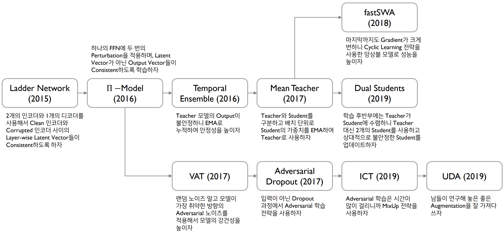</p>


### 2-1. Ladder Network
Ladder Network는 2개의 인코더와 1개의 디코더를 생성하여 labeled data는 정답을 잘 맞추면서 두 인코더 사이의 hidden states가 유사하도록, unlabeled data는 두 인코더 사이의 hidden states가 유사하도록 학습한다. 해당 방법론의 가장 큰 특징은 layer-wise로 noise를 부여한 뒤 이를 디코더가 다시 원본 데이터와 비슷하게 만들어내는데, labeled data를 보고 학습하는 인코더의 hidden states와 각 layer에서 consistency(일관성)를 유지하고자 하는 것이 특징이다.  

<p align="center">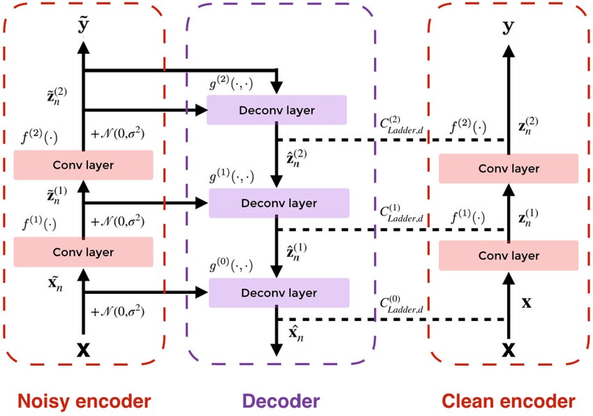</p>


### 2-2. $\Gamma$-Model
$\Gamma$-Model(감마모델)은 이전 모델인 Ladder Network에서 layer-wise로 일관성을 유지하는 것은 너무 빡빡하다는 아이디어에서 시작해 가장 낮은 부분의 hidden 값에서만 일관성을 유지하고자 한 방법론이다. 따라서, 아래 그림과 같이 latent vector에 대해서만 일관성을 유지하도록 했다.

<p align="center">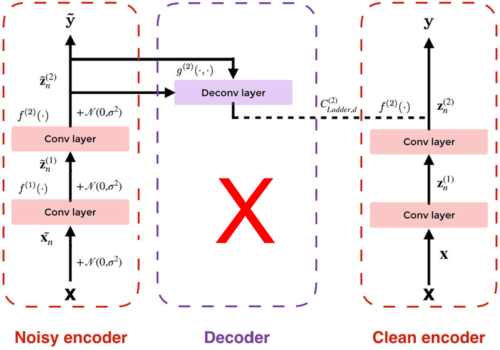</p>


### 2-3. $\Pi$-Model
$\Pi$-Model(파이모델)부터는 1개의 모델에서 consistency를 수행한다. 아래 그림과 같이, 하나의 데이터 샘플에 대해 서로다른 2개의 augmentation과 모델에 서로 다른 2번의 dropout을 적용해 하나의 모델이 2개의 모델과 같은 효과를 내도록 했다. 이후 라벨과 하나의 변형 결과와 Cross-entropy로 loss를, 2개의 변형 결과에 대해서는 MSE loss를 통해 학습한다. 특히 해당 방법론에서는 hidden states가 아닌 최종 output들 사이에 대해서 일관성을 유지한다는 것이 특징이다.

<p align="center">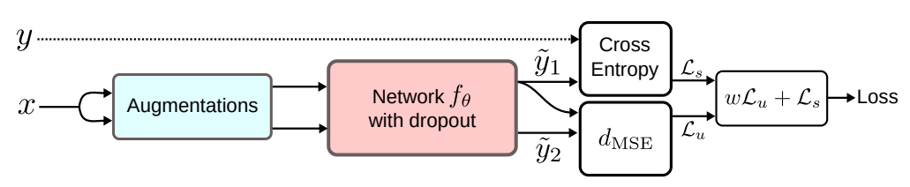</p>


### 2-4. Temporal Ensemble
Temporal Ensemble은 이전 모델들은 학습과정에서 매번 업데이트를 수행하니 noise에 영향을 너무 많이 받아 업데이트가 너무 크게 변한다는 한계점을 지적하면서 시작한다. 이에 저자들은 매번 업데이트를 수행하지 말고, 과거 예측한 값들을 누적해서 smoothing하고자 했다.  

$$
Z \leftarrow \alpha Z + (1-\alpha)z
$$

$$
\tilde z \leftarrow Z / (1-\alpha^t)
$$

한 Epoch마다 전체 데이터셋을 input하여 예측한 output의 분포 Z를 누적해서 저장한다. 이후 모델의 결과로 나온 $z$와 $\tilde z$를 비교하며 학습을 수행한다. 즉, target 분포 Z를 누적해서 앙상블 효과를 가져올 수 있도록 한 것이 특징이다.  

<p align="center">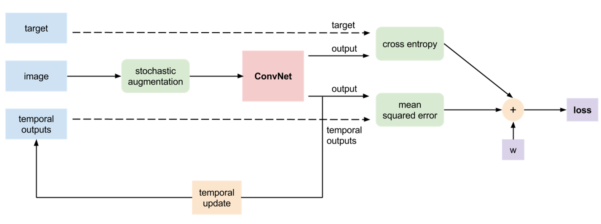</p>


### 2-5. Mean Teacher
Mean Teacher부터는 다시 2개의 모델로 학습을 수행한다. 하나의 모델에서 teacher와 student 역할 모두를 수행하는 것은 부적절하다고 언급하고, 특히 앞선 모델인 Temporal Ensemble은 1 epoch 당 $\tilde z$가 한번씩 변해서 학습속도가 느리다는 단점을 지적한다. 이에 해당 논문의 저자들은 teacher와 student 모델을 분리하고, mini-batch가 끝날 때마다 모델의 가중치를 EMA로 업데이트하도록 했다.  

<p align="center">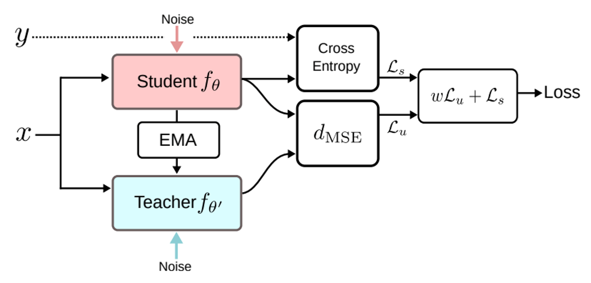</p>


### 2-6. Dual Students
Dual Students는 이전의 Mean Teacher의 방법론의 한계를 지적하는데, 바로 학습이 진행될수록 teacher가 결국 student에 비슷하게 수렴해간다는 문제이다. 실제로 student를 독립적으로 2개를 두고 Mean Teacher의 방식대로 학습한 결과, 학습이 계속 진행되어도 두 student 사이에는 차이가 있었지만, Mean Teacher의 teacher와 student에서는 서로가 같아지도록 수렴하고 있었다. 이는 한번 잘못 예측하면 계속해서 잘못 예측하고 결국 corrective할 기회가 없다는 문제가 존재한다.  
모델의 학습 과정은 아래의 그림과 같이, 각각의 student 모델을 서로다르게 init하고 2개의 노이즈를 각 모델에 적용한다. 각 모델은 같은 노이즈 2번을 주었으니 결과는 비슷해야한다는 일관성을 가지도록 학습함과 동시에, 두 모델 모두 정답을 다 맞춰야 한다. 특히 2개의 student 가운데 학습 중 더 안정적인 모델이 teacher 역할을 번갈아가며 수행할 수 있도록 한 것이 특징이다.  

<p align="center">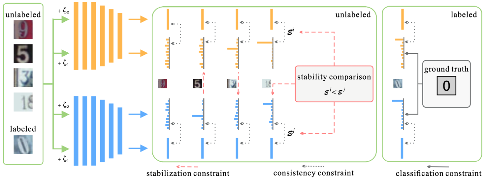</p>

### 2-7. fastSWA
fastSWA는 앞선 consistency loss를 지적하는데, 학습 과정의 supervised loss와 cross-entropy, concsistency loss를 분해해 살펴본 결과 consistency loss는 전혀 줄지 않고 있는 모습이었다. 여전히 모델의 gradient가 크다는 것을 의미하고, 특히 optima의 형태가 완전한 convex하지 않고 large flat region한 형태를 가지고 있었다.  
따라서 해당 논문에서는 180 epoch 이상에서 5 epoch마다 모델의 weight checkpoint를 만들어 이를 평균내서 하나의 모델을 생성하도록 했다. 특히 하나의 epoch마다 하나의 checkpoint가 아닌 여러개의 checkpoint를 만들고, 나중에 이를 평균내어 더 빠르게 수렴하도록 한 것이 특징이다. 아래 그림의 가장 오른쪽과 같이, 여러 checkpoint들을 평균내 가운데로 수렴하도록 만들어주는 것이 목적이다.  

<p align="center">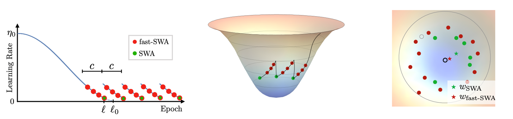</p>


### 2-8. VAT(Virtual Adversarial Training)
Virtual Adversarial Training은 noise를 부여하는 방법 자체에 한계점을 지적한다. 여러 샘플 가운데, decision boundary에 가까운 샘플에 noise를 가하면 class가 다르게 변해버리는 취약점을 언급했다. 분포가 고르게 샘플링되지 않은 데이터를 가지고 학습하면 결국 클래스의 분포끼리 서로 침범받는 문제가 있다. 따라서, unlabeled data에서 현재 추정된 출력 분포를 가장 크게 벗어날 수 있는 방향으로 가상 training을 수행하여 이상적인 분포의 형태로 학습시키고자 했다.  
아래 그림과 같이, labeled data는 정답을 맞출 수 있도록 학습하고, 해당 샘플의 adversial direction을 찾아 해당 방향으로 noise를 가해 학습을 수행한다.  

<p align="center">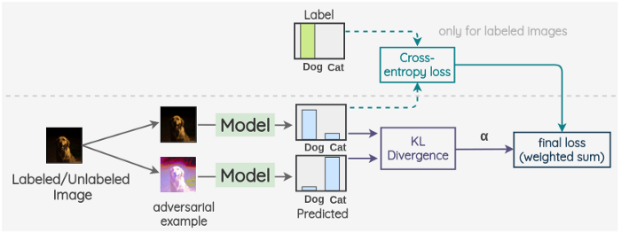</p>


### 2-9. Adversarial Dropout
Adversarial Dropout은 모델의 입력이 아닌 dropout 과정에서 adversarial하게 학습하도록 한 방법론이다. hidden node들에 dropout을 어떻게 가하는지로 adversial하게 학습한다.  

### 2-10. ICT(Interpolation Consistency Training)
ICT는 VAT와 AD에서 적대적인 방향을 계속 탐색해야하기 때문에 컴퓨팅이 효율적이지 못하다는 문제를 지적한다. 이에 저자들은 2개의 unlabeled data를 mix-up해서, mix-up한 데이터에 대한 모델 결과와 unlabeled sample의 모델 결과의 mix-up 차이가 일관성을 유지하도록 했다. 하지만 mix-up을 사용하면 각 클래스 사이의 경계면이 모호해지는 문제가 있다. 

<p align="center">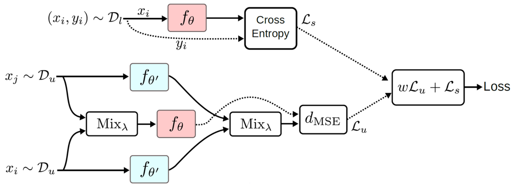</p>


### 2-11. UDA(Unsupervised Data Augmentation)
UDA는 많은 사람들이 연구해 놓은 방법론의 좋은 augmentation 기법들을 잘 가져다 쓰자는 것이 특징인 방법론이다. 해당 논문은 여러 augmentation을 수행해 consistency loss로 학습하는데, 자연어의 back translation 기법, 강화학습 기반의 autoaugment, TF-IDF를 통한 단어 대체 등의 여러 방법을 사용한다. 

<p align="center">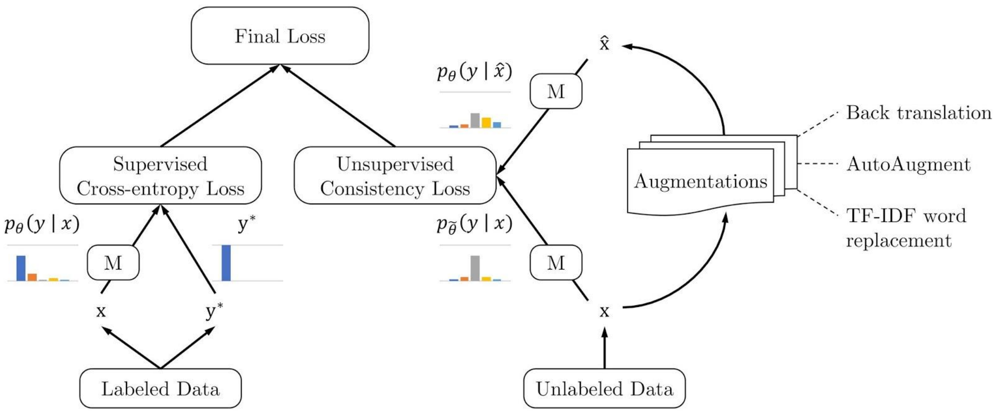</p>


### Reference)  
- https://github.com/CuriousAI/mean-teacher/tree/master/pytorch
- 고려대학교 강필성 교수님 비즈니스애널리틱스 강의자료(2022 Fall)  

---

# 2. Tutorial Note

## Semi-supervised Learning Tutorial

Tutorial은 Consistency Regularization 가운데 Mean Teacher 방법론을 선택하여 수행해보았습니다.
이번 Tutorial의 목적은 다음과 같습니다.

- fastSWA에서 한계점으로 지적한 것과 같이 consistency loss가 줄어들지 않는지 확인
- consistency loss를 MSE, KL-Divergence, Jensen-Shannon Divergence를 각각 사용해서 학습한 뒤, loss의 흐름 시각화


실행은 터미널에서 아래 코드를 통해 실행시킬 수 있으며, 학습에 사용한 하이퍼파라미터도 다음과 같이 확인할 수 있습니다. Consistency loss를 3가지로 정의하고 --consistency-type의 argparse를 mse, kl, js로 바꿔가며 실험을 수행해보았습니다.  
```bash
python main.py --dataset cifar10 --labels data-local/labels/cifar10/1000_balanced_labels/00.txt --arch cifar_shakeshake26 --consistency 100.0 --consistency-rampup 5 --labeled-batch-size 31 --epochs 30 --batch-size 128 --consistency-type [cons loss]
```


Tutorial은 논문의 저자들이 github에 공개한 소스코드를 불러와 cifar-10 데이터셋을 이용하여 수행하였습니다. 코드 전체는 아래 링크(혹은 method 폴더)에서 확인할 수 있으며 본 페이지에서는 tutorial의 결과에 대해 먼저 서술하고 이후 간략한 코드 설명을 수행합니다. 다만, 실험은 ubuntu 환경에서 gpu 자원을 활용해 학습하였기 때문에 학습 과정에서의 loss와 acc 등의 결과만 10 iter마다 저장하도록 했습니다.   

- [Architecture](./method/mean_teacher/architectures.py)
- [Trainer](./method/main.py)
- [loss function](./method/mean_teacher/losses.py)

학습 과정의 loss와 acc는 results 폴더에 pickle 파일로 저장되어 있으며, 해당 실험에 확인하고자 한 학습 과정의 loss 시각화 코드는 results 폴더의 results_visulize.ipynb 파일에서 확인할 수 있습니다.  

- [Visualize Results](./results/results_visualize.ipynb)


  
---
## Results
논문에서 제시한 학습 epoch 수는 180이지만, 본 실험에서는 모델을 끝까지 학습하는 것보다는 tutorial 목적에 따른 학습 양상을 보고자하는데 목적이 있어 30 epoch만 수행했습니다. 데이터는 앞서 제시한대로 cifar-10 데이터셋을 사용하였고, 모델은 ResNet-32 모델을 백본으로 사용했습니다.  


### 1. Consistency loss가 줄어들지 않는지 확인
논문에서 저자들이 사용한 MSE Loss를 consistency loss로 사용했을 때의 학습 loss를 시각화해본 결과입니다.

<p align="center">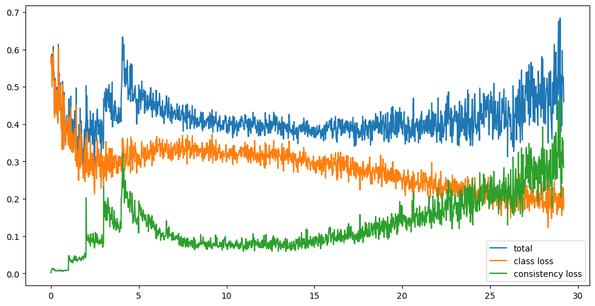</p>

> 실험결과, class loss는 점점 loss가 수렴하고 있는 결과이지만, 오히려 consistency loss는 줄지 않는 모습을 보여주고 있습니다.. 30Epoch만 실험해본 결과이기 때문에 학습을 조금 더 수행하면 어떤 양상을 보일지 모르겠지만, fastSWA에서 지적한 바와 같이 consistency loss가 줄지 않는 모습이 계속될 것으로 예상됩니다.


### 2. Consistency loss를 MSE, KL-Divergence, Jensen-Shannon Divergence를 각각 사용해서 학습한 뒤, loss의 흐름 시각화
- 아래 수식에 해당하는 student 모델의 output과 teacher 모델의 output 사이에 3가지 loss를 사용해 평가해본 결과


$$
J(\theta)=E_{x, \eta^{'}, \eta}[\parallel f(x, \theta^{'}, \eta^{'})-f(x, \theta, \eta) \parallel ^2]
$$


- MSE Loss


$$
d_{MSE}(f(x, \theta^{'}, \eta^{'})-f(x, \theta, \eta)) = {{1}\over{C}}\sum_{k=1}^C (f(x, \theta^{'}, \eta^{'})_k-f(x, \theta, \eta)_k)
$$


<p align="center"></p>

- KL Divergence Loss


$$
d_{KL}(f(x, \theta^{'}, \eta^{'})-f(x, \theta, \eta))={{1}\over{C}} \sum_{k=1}^C f(x, \theta, \eta)_k log {{f(x, \theta, \eta)_k}\over{f(x, \theta^{'}, \eta^{'})_k}}
$$


<p align="center">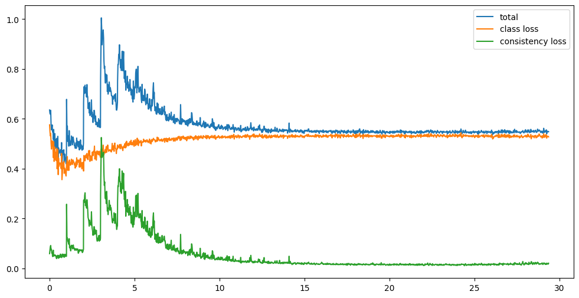</p>

> 실험결과, Consistency loss를 KL Divergence로 사용했을 때 consistency는 수렴하고 있는 모습인 반면, supervised loss가 학습이 계속 진행됨에도 줄지 않는 모습이었습니다.

- Jensen-Shannon Divergence Loss


$$
d_{JS}(f(x, \theta, \eta),f(x, \theta^{'}, \eta^{'}))={{1}\over{2}}d_{KL}(f(x, \theta, \eta),m) + {{1}\over{2}}d_{KL}(f(x, \theta^{'}, \eta^{'}),m) 
$$


<p align="center">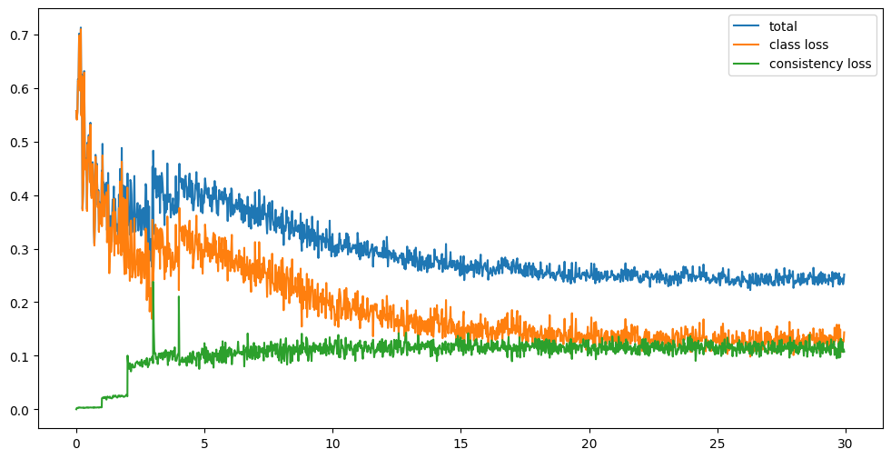</p>

> 실험결과, Consistency loss를 JS Divergence로 사용했을 때 supervised loss는 점차 줄어드는 모습이 예상되지만, consistency loss는 줄지 않고 계속 일정한 loss를 유지하고 있는 모습이었습니다.

- Loss function마다 전체 loss

<p align="center">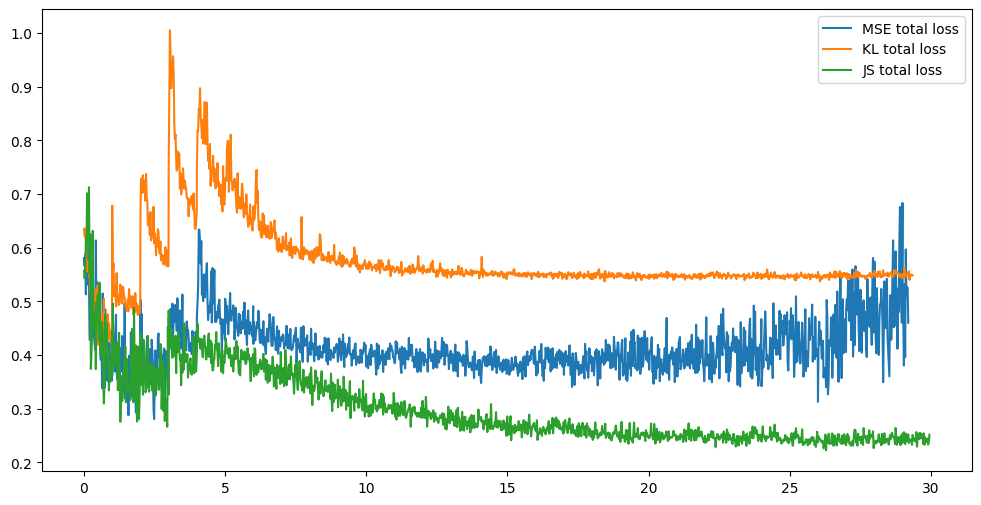</p>

> 각 consistency function마다 전체 loss를 비교해본 결과, JS Divergence loss를 사용했을 때 가장 잘 수렴하는 모습이었습니다. 

- Loss function마다 consistency loss

<p align="center">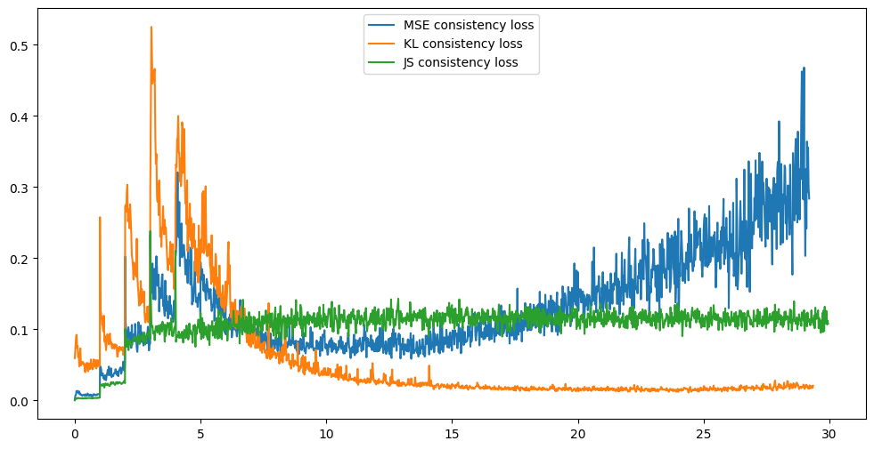</p>

> 전체 loss의 결과 대비 consistency loss만 보았을 때, KL divergence가 가장 잘 수렴하는 모습이었습니다. 하지만, KL divergence loss를 사용하면 supervised loss가 줄지 않아 전체 loss가 가장 큰 모습으로 해당 function 사용을 통한 학습은 적절하지 않을 것으로 판단됩니다. 본 논문의 저자들은 Temporal Ensembling의 저자들이 사용한대로 MSE loss를 사용했지만, 왜 JS Divergence는 사용하지 않았는지 추가적인 고찰이 필요할 것으로 판단됩니다.  

---
## 모델구현
모델은 ResNet 아키텍처를 이용해서 Mean Teacher 방법론으로 semi-supervised 방식으로 학습됩니다. 핵심 코드 부분만 보면, 코드의 흐름을 파악할 수 있습니다. 전체 코드는 method 폴더 안에 소스코드에서 확인할 수 있습니다.  

### Backbone 모델 ResNet-32 정의 code
```python
class ResNet32x32(nn.Module):
    def __init__(self, block, layers, channels, groups=1, num_classes=1000, downsample='basic'):
        super().__init__()
        assert len(layers) == 3
        self.downsample_mode = downsample
        self.inplanes = 16
        self.conv1 = nn.Conv2d(3, 16, kernel_size=3, stride=1,
                               padding=1, bias=False)
        self.layer1 = self._make_layer(block, channels, groups, layers[0])
        self.layer2 = self._make_layer(
            block, channels * 2, groups, layers[1], stride=2)
        self.layer3 = self._make_layer(
            block, channels * 4, groups, layers[2], stride=2)
        self.avgpool = nn.AvgPool2d(8)
        self.fc1 = nn.Linear(block.out_channels(
            channels * 4, groups), num_classes)
        self.fc2 = nn.Linear(block.out_channels(
            channels * 4, groups), num_classes)

        for m in self.modules():
            if isinstance(m, nn.Conv2d):
                n = m.kernel_size[0] * m.kernel_size[1] * m.out_channels
                m.weight.data.normal_(0, math.sqrt(2. / n))
            elif isinstance(m, nn.BatchNorm2d):
                m.weight.data.fill_(1)
                m.bias.data.zero_()

    def _make_layer(self, block, planes, groups, blocks, stride=1):
        downsample = None
        if stride != 1 or self.inplanes != block.out_channels(planes, groups):
            if self.downsample_mode == 'basic' or stride == 1:
                downsample = nn.Sequential(
                    nn.Conv2d(self.inplanes, block.out_channels(planes, groups),
                              kernel_size=1, stride=stride, bias=False),
                    nn.BatchNorm2d(block.out_channels(planes, groups)),
                )
            elif self.downsample_mode == 'shift_conv':
                downsample = ShiftConvDownsample(in_channels=self.inplanes,
                                                 out_channels=block.out_channels(planes, groups))
            else:
                assert False

        layers = []
        layers.append(block(self.inplanes, planes, groups, stride, downsample))
        self.inplanes = block.out_channels(planes, groups)
        for i in range(1, blocks):
            layers.append(block(self.inplanes, planes, groups))

        return nn.Sequential(*layers)

    def forward(self, x):
        x = self.conv1(x)
        x = self.layer1(x)
        x = self.layer2(x)
        x = self.layer3(x)
        x = self.avgpool(x)
        x = x.view(x.size(0), -1)
        return self.fc1(x), self.fc2(x)


def conv3x3(in_planes, out_planes, stride=1):
    "3x3 convolution with padding"
    return nn.Conv2d(in_planes, out_planes, kernel_size=3, stride=stride,
                     padding=1, bias=False)


class ShakeShakeBlock(nn.Module):
    @classmethod
    def out_channels(cls, planes, groups):
        assert groups == 1
        return planes

    def __init__(self, inplanes, planes, groups, stride=1, downsample=None):
        super().__init__()
        assert groups == 1
        self.conv_a1 = conv3x3(inplanes, planes, stride)
        self.bn_a1 = nn.BatchNorm2d(planes)
        self.conv_a2 = conv3x3(planes, planes)
        self.bn_a2 = nn.BatchNorm2d(planes)

        self.conv_b1 = conv3x3(inplanes, planes, stride)
        self.bn_b1 = nn.BatchNorm2d(planes)
        self.conv_b2 = conv3x3(planes, planes)
        self.bn_b2 = nn.BatchNorm2d(planes)

        self.downsample = downsample
        self.stride = stride

    def forward(self, x):
        a, b, residual = x, x, x

        a = F.relu(a, inplace=False)
        a = self.conv_a1(a)
        a = self.bn_a1(a)
        a = F.relu(a, inplace=True)
        a = self.conv_a2(a)
        a = self.bn_a2(a)

        b = F.relu(b, inplace=False)
        b = self.conv_b1(b)
        b = self.bn_b1(b)
        b = F.relu(b, inplace=True)
        b = self.conv_b2(b)
        b = self.bn_b2(b)

        ab = shake(a, b, training=self.training)

        if self.downsample is not None:
            residual = self.downsample(x)

        return residual + ab


class Shake(Function):
    @classmethod
    def forward(cls, ctx, inp1, inp2, training):
        assert inp1.size() == inp2.size()
        gate_size = [inp1.size()[0], *itertools.repeat(1, inp1.dim() - 1)]
        gate = inp1.new(*gate_size)
        if training:
            gate.uniform_(0, 1)
        else:
            gate.fill_(0.5)
        return inp1 * gate + inp2 * (1. - gate)

    @classmethod
    def backward(cls, ctx, grad_output):
        grad_inp1 = grad_inp2 = grad_training = None
        gate_size = [grad_output.size()[0], *itertools.repeat(1,
                                                              grad_output.dim() - 1)]
        gate = Variable(grad_output.data.new(*gate_size).uniform_(0, 1))
        if ctx.needs_input_grad[0]:
            grad_inp1 = grad_output * gate
        if ctx.needs_input_grad[1]:
            grad_inp2 = grad_output * (1 - gate)
        assert not ctx.needs_input_grad[2]
        return grad_inp1, grad_inp2, grad_training


def shake(inp1, inp2, training=False):
    return Shake.apply(inp1, inp2, training)


class ShiftConvDownsample(nn.Module):
    def __init__(self, in_channels, out_channels):
        super().__init__()
        self.relu = nn.ReLU(inplace=True)
        self.conv = nn.Conv2d(in_channels=2 * in_channels,
                              out_channels=out_channels,
                              kernel_size=1,
                              groups=2)
        self.bn = nn.BatchNorm2d(out_channels)

    def forward(self, x):
        x = torch.cat((x[:, :, 0::2, 0::2],
                       x[:, :, 1::2, 1::2]), dim=1)
        x = self.relu(x)
        x = self.conv(x)
        x = self.bn(x)
        return x
```

### Mean Teacher 방법 구현 code
student와 teacher 모델을 각각 model, ema_model로 정의하고, 각 mini-batch가 끝날 때마다 model의 파라미터를 ema_model에 업데이트합니다. 
```python
# ema update
def update_ema_variables(model, ema_model, alpha, global_step):
    alpha = min(1 - 1 / (global_step + 1), alpha)
    for ema_param, param in zip(ema_model.parameters(), model.parameters()):
        ema_param.data.mul_(alpha).add_(1 - alpha, param.data)

# train
def train(train_loader, model, ema_model, optimizer, epoch, log):
    global global_step

    class_criterion = nn.CrossEntropyLoss(size_average=False, ignore_index=NO_LABEL).cuda()
    if args.consistency_type == 'mse':
        consistency_criterion = losses.softmax_mse_loss
    elif args.consistency_type == 'kl':
        consistency_criterion = losses.softmax_kl_loss
    elif args.consistency_type == 'js':
        consistency_criterion = losses.JSD
    else:
        assert False, args.consistency_type
    residual_logit_criterion = losses.symmetric_mse_loss

    meters = AverageMeterSet()

    # switch to train mode
    model.train()
    ema_model.train()

    end = time.time()
    for i, ((input, ema_input), target) in enumerate(train_loader):
        # measure data loading time
        meters.update('data_time', time.time() - end)

        adjust_learning_rate(optimizer, epoch, i, len(train_loader))
        meters.update('lr', optimizer.param_groups[0]['lr'])

        input_var = torch.autograd.Variable(input)
        ema_input_var = torch.autograd.Variable(ema_input, volatile=True)
        target_var = torch.autograd.Variable(target.cuda(non_blocking=True))

        minibatch_size = len(target_var)
        labeled_minibatch_size = target_var.data.ne(NO_LABEL).sum()
        assert labeled_minibatch_size > 0
        meters.update('labeled_minibatch_size', labeled_minibatch_size)

        ema_model_out = ema_model(ema_input_var)
        model_out = model(input_var)

        if isinstance(model_out, Variable):
            assert args.logit_distance_cost < 0
            logit1 = model_out
            ema_logit = ema_model_out
        else:
            assert len(model_out) == 2
            assert len(ema_model_out) == 2
            logit1, logit2 = model_out
            ema_logit, _ = ema_model_out

        ema_logit = Variable(ema_logit.detach().data, requires_grad=False)

        if args.logit_distance_cost >= 0:
            class_logit, cons_logit = logit1, logit2
            res_loss = args.logit_distance_cost * residual_logit_criterion(class_logit, cons_logit) / minibatch_size
            meters.update('res_loss', res_loss.data[0])
        else:
            class_logit, cons_logit = logit1, logit1
            res_loss = 0

        class_loss = class_criterion(class_logit, target_var) / minibatch_size
        meters.update('class_loss', class_loss.data.item())

        ema_class_loss = class_criterion(ema_logit, target_var) / minibatch_size
        meters.update('ema_class_loss', ema_class_loss.data.item())

        if args.consistency:
            consistency_weight = get_current_consistency_weight(epoch)
            meters.update('cons_weight', consistency_weight)
            consistency_loss = consistency_weight * consistency_criterion(cons_logit, ema_logit) / minibatch_size
            meters.update('cons_loss', consistency_loss.data.item())
        else:
            consistency_loss = 0
            meters.update('cons_loss', 0)

        loss = class_loss + consistency_loss + res_loss
        meters.update('loss', loss.data.item())

        prec1, prec5 = accuracy(class_logit.data, target_var.data, topk=(1, 5))
        meters.update('top1', prec1.item(), labeled_minibatch_size)
        meters.update('error1', 100. - prec1.item(), labeled_minibatch_size)
        meters.update('top5', prec5.item(), labeled_minibatch_size)
        meters.update('error5', 100. - prec5.item(), labeled_minibatch_size)

        ema_prec1, ema_prec5 = accuracy(ema_logit.data, target_var.data, topk=(1, 5))
        meters.update('ema_top1', ema_prec1.item(), labeled_minibatch_size)
        meters.update('ema_error1', 100. - ema_prec1.item(), labeled_minibatch_size)
        meters.update('ema_top5', ema_prec5.item(), labeled_minibatch_size)
        meters.update('ema_error5', 100. - ema_prec5.item(), labeled_minibatch_size)

        # compute gradient and do SGD step
        optimizer.zero_grad()
        loss.backward()
        optimizer.step()
        global_step += 1
        update_ema_variables(model, ema_model, args.ema_decay, global_step)

        # measure elapsed time
        meters.update('batch_time', time.time() - end)
        end = time.time()
```

### consistency loss 정의 code
본 tutorial의 실험을 위해 MSE, KL divergence, JS Divergence 3가지 loss를 각각 정의하고 main.py의 train 함수에서 작동할 수 있도록 했습니다.  
```python
# MSE Loss
def softmax_mse_loss(input_logits, target_logits):
    assert input_logits.size() == target_logits.size()
    input_softmax = F.softmax(input_logits, dim=1)
    target_softmax = F.softmax(target_logits, dim=1)
    num_classes = input_logits.size()[1]
    return F.mse_loss(input_softmax, target_softmax, size_average=False) / num_classes

# KL Divergence Loss
def softmax_kl_loss(input_logits, target_logits):
    assert input_logits.size() == target_logits.size()
    input_log_softmax = F.log_softmax(input_logits, dim=1)
    target_softmax = F.softmax(target_logits, dim=1)
    return F.kl_div(input_log_softmax, target_softmax, size_average=False)

# Jensen-Shannon Divergence Loss
def JSD(input_logits, target_logits):
    input_softmax =  F.softmax(input_logits, dim=1)
    target_softmax=  F.softmax(target_logits, dim=1)

    m = 0.5 * (input_softmax + input_softmax)
    loss = 0.0
    loss += F.kl_div(F.log_softmax(input_softmax, dim=1), m, reduction="batchmean") 
    loss += F.kl_div(F.log_softmax(target_softmax, dim=1), m, reduction="batchmean") 
  
    return (0.5 * loss)
```


---
### Reference)  
- https://github.com/CuriousAI/mean-teacher/tree/master/pytorch  
- https://arxiv.org/pdf/1703.01780v6.pdf